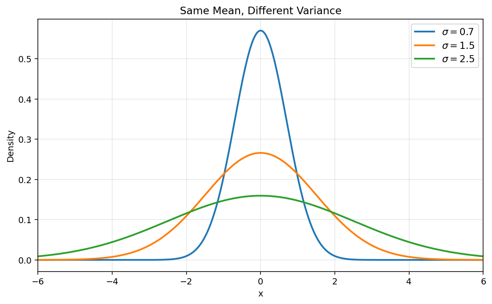
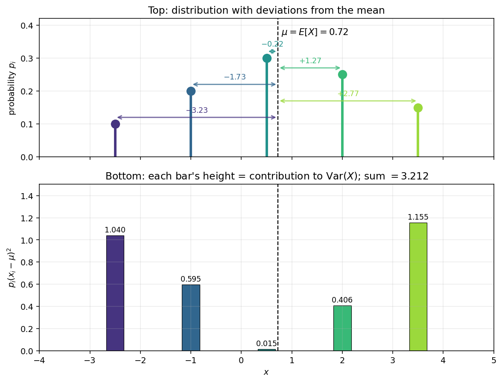

# 정의와 계산

기댓값은 분포를 하나의 수, 곧 *질량중심*으로 요약한다. 그러나 평균이 같은 두 분포라도 생김새는 아주 다를 수 있다. 하나는 좁게 뭉쳐 있고 다른 하나는 넓게 흩어져 있을 수 있다. **분산**은 $X$ 의 값들이 평균 둘레에 얼마나 넓게 퍼져 있는지를 재어 이 빠진 조각을 메운다.

## 정의

확률변수 $X$ 의 **분산**은 다음과 같다.

$$
\text{Var}(X) = E\left[(X - E[X])^2\right] = E\left[(X - \mu)^2\right]
$$

여기서 $\mu = E[X]$ 이다.

분산은 분포가 평균 둘레에 얼마나 **퍼져** 있는지, 곧 **흩어진 정도**를 잰다. 분산은 언제나 음이 아니다. 곧 $\text{Var}(X) \geq 0$ 이다.



*평균은 $\mu = 0$ 으로 같지만 표준편차가 $\sigma \in \{0.7, 1.5, 2.5\}$ 로 서로 다른 세 정규밀도. 셋 모두 적분값이 $1$ 이고 퍼진 정도만 다르다. $\sigma$ 가 커질수록 곡선은 넓고 납작해지며, 봉우리의 높이는 $1/\sigma$ 에 비례해 낮아진다. 전체 넓이를 지키려면 넓은 곡선은 낮아질 수밖에 없기 때문이다.*

기하학적으로 보면 분산은 $X$ 에서 상수 확률변수들이 이루는 공간까지의 **$L^2$-거리의 제곱**이다. $\mu$ 는 평균제곱의 뜻에서 $X$ 에 가장 가까운 상수이고(아래 연습문제 2 참조), $\text{Var}(X)$ 는 그 가장 가까운 상수로부터의 제곱편차를 잰다. 이 관점은 뒤에 나올 최소제곱법, 직교사영, 회귀의 바탕이 된다.



*위: 다섯 점으로 이루어진 이산분포와, 평균에서 뻗어 나온 화살표로 나타낸 편차 $x_i - \mu$. 아래: 각 막대의 높이는 그 결과가 $\operatorname{Var}(X)$ 에 기여하는 몫 $p_i (x_i - \mu)^2$ 이며, 막대들의 합이 전체 분산이다. 편차를 제곱하기 때문에 평균에서 멀리 떨어진 결과일수록 크게 기여한다.*

---

## 분산의 계산

### 이산인 경우

$$
\text{Var}(X) = \sum_x (x - \mu)^2 \, p(x)
$$

### 연속인 경우

$$
\text{Var}(X) = \int_{-\infty}^{\infty} (x - \mu)^2 \, f(x) \, dx
$$

---

## 예제

### 베르누이분포

$X \sim \text{Bernoulli}(p)$ 이면 $\mu = p$ 이고 다음을 얻는다.

$$
\text{Var}(X) = (0-p)^2(1-p) + (1-p)^2 p = p^2(1-p) + (1-p)^2 p = p(1-p) = pq
$$

### 공정한 주사위

$X$ 가 공정한 주사위의 눈이면 $\mu = 3.5$ 이고 다음을 얻는다.

$$
\text{Var}(X) = \frac{1}{6}\sum_{k=1}^6 (k - 3.5)^2 = \frac{(2.5)^2 + (1.5)^2 + (0.5)^2 + (0.5)^2 + (1.5)^2 + (2.5)^2}{6} = \frac{17.5}{6} \approx 2.917
$$

### 연속균등분포

$X \sim \text{Uniform}(a,b)$ 이면 다음과 같다.

$$
\text{Var}(X) = \frac{(b-a)^2}{12}
$$

---

## 성질

1. $\text{Var}(X) \geq 0$ 이며, 등호는 $X$ 가 확률 1로 상수일 때 그리고 오직 그때만 성립한다

2. 임의의 상수 $c$ 에 대하여 $\text{Var}(c) = 0$

3. $\text{Var}(X)$ 가 유한할 필요충분조건은 $E[X^2] < \infty$ 이다

4. **아핀변환:** 상수 $a$, $b$ 에 대하여 다음이 성립한다.

    $$
    \text{Var}(aX + b) = a^2 \, \text{Var}(X)
    $$

    평행이동 $b$ 는 분산을 바꾸지 않고(평행이동 불변성), $a$ 배로 늘리면 분산은 $a^2$ 배가 된다. 분산이 *제곱* 단위의 양이기 때문이다. 실제 계산에서 가장 자주 쓰는 규칙이다.

    *증명.* $\mu = E[X]$ 라 하면 $E[aX + b] = a\mu + b$ 이다. 그러면 다음을 얻는다.

    $$
    \text{Var}(aX + b) = E\!\left[(aX + b - a\mu - b)^2\right] = E\!\left[a^2 (X - \mu)^2\right] = a^2 \, \text{Var}(X)
    $$

    $\square$

!!! info "앞으로 나올 이야기: 공분산"
    두 확률변수 $X, Y$ 에 대하여 분산의 자연스러운 쌍선형 짝은 **공분산**이다.

    $$
    \text{Cov}(X, Y) = E\!\left[(X - E[X])(Y - E[Y])\right]
    $$

    $\text{Cov}(X, X) = \text{Var}(X)$ 임에 주목하자. 공분산은 뒤의 장에서 자세히 다루며, 한 변수의 분산에서 여러 변수의 흩어짐으로 건너가는 다리가 된다.

---

## 파이썬 구현

```python
import numpy as np

# 베르누이분포의 분산
p = 0.3
var_bernoulli = p * (1 - p)
print(f"Var(Bernoulli({p})) = {var_bernoulli}")

# 공정한 주사위의 분산
values = np.arange(1, 7)
probs = np.ones(6) / 6
mu = np.sum(values * probs)
var_die = np.sum((values - mu)**2 * probs)
print(f"Var(fair die) = {var_die:.4f}")  # 2.9167

# 균등분포의 분산
a, b = 0, 1
var_uniform = (b - a)**2 / 12
print(f"Var(Uniform({a},{b})) = {var_uniform:.4f}")
```

??? note "덧붙임: 수치로 확인하기 (몬테카를로)"
    위의 정확한 계산은 모의실험으로도 맞대어 볼 수 있다. 표본을 많이 뽑아 표본분산을 구하면 된다. 공정한 주사위의 경우는 다음과 같다.

    ```python
    import numpy as np
    rng = np.random.default_rng(42)
    samples = rng.integers(1, 7, size=1_000_000)
    print(f"MC Var(die) = {np.var(samples):.4f}")  # ≈ 2.9167
    ```

    큰수의 법칙에 따라 표본분산은 $O(1/\sqrt{N})$ 의 빠르기로 이론값에 수렴한다.

## 연습문제

**연습문제 1.** $P(X = -2) = 1/4$, $P(X = 0) = 1/2$, $P(X = 3) = 1/4$ 인 이산확률변수 $X$ 의 분산을 구하여라.

??? success "연습문제 1 풀이"
    $$
    E[X] = -2 \cdot \tfrac{1}{4} + 0 \cdot \tfrac{1}{2} + 3 \cdot \tfrac{1}{4} = \tfrac{1}{4}
    $$

    $$
    E[X^2] = 4 \cdot \tfrac{1}{4} + 0 \cdot \tfrac{1}{2} + 9 \cdot \tfrac{1}{4} = \tfrac{13}{4}
    $$

    $$
    \text{Var}(X) = \tfrac{13}{4} - \tfrac{1}{16} = \tfrac{52 - 1}{16} = \frac{51}{16} \approx 3.19
    $$

---

**연습문제 2.** 임의의 상수 $c$ 에 대하여 $E[(X - c)^2]$ 은 $c = E[X]$ 일 때 가장 작아지고 그 최솟값이 $\text{Var}(X)$ 임을 보여라.

??? success "연습문제 2 풀이"
    $\mu = E[X]$ 라 하고 전개하자.

    $$
    E[(X - c)^2] = E[((X - \mu) + (\mu - c))^2] = E[(X - \mu)^2] + 2(\mu - c) E[X - \mu] + (\mu - c)^2
    $$

    $E[X - \mu] = 0$ 이므로 가운데 항이 사라진다. 따라서 다음을 얻는다.

    $$
    E[(X - c)^2] = \text{Var}(X) + (\mu - c)^2
    $$

    이 값은 $c = \mu$ 로 고를 때 가장 작아지며 그때의 최솟값은 $\text{Var}(X)$ 이다. $\square$
