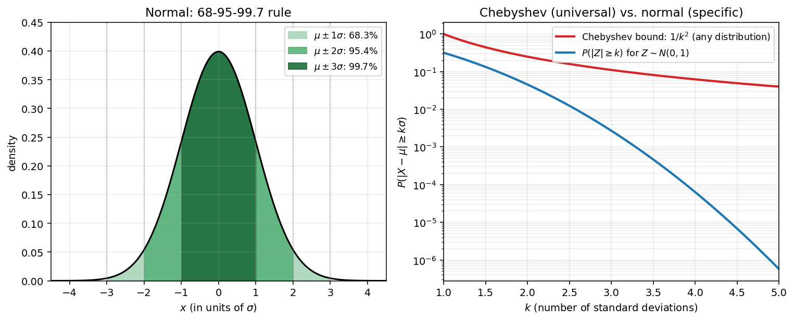
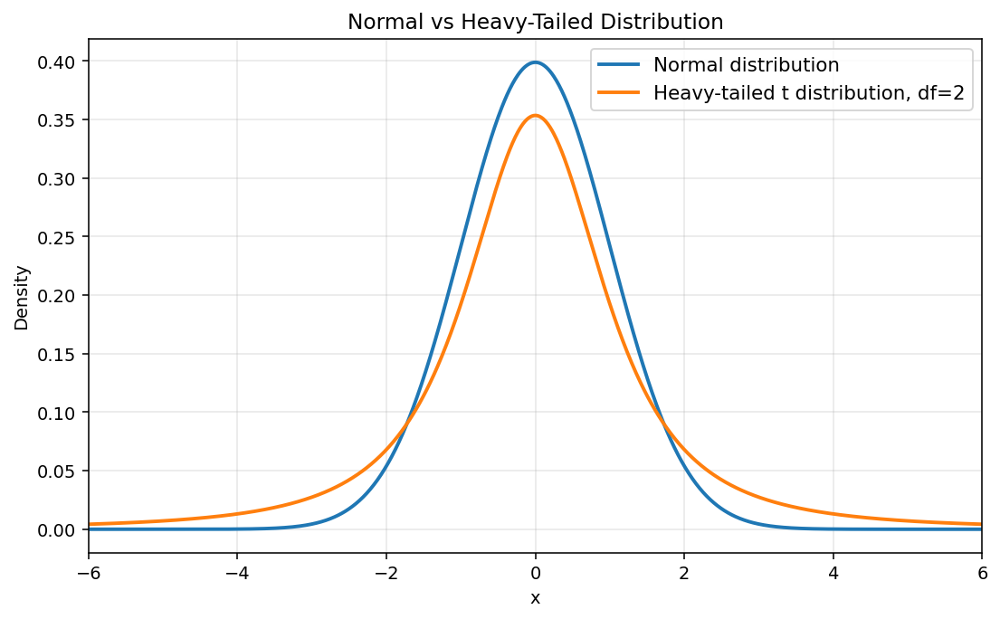

# 표준편차

분산은 단위가 맞지 않는다. $X$ 를 미터로 잰다면 $\text{Var}(X)$ 의 단위는 제곱미터이다. **표준편차**는 분산의 제곱근으로, $X$ 의 원래 단위를 되살려 평균으로부터의 거리로 곧바로 읽을 수 있게 해 준다. 신뢰구간, 체비쇼프 부등식, 그리고 일상적인 통계 보고에 분산이 아니라 표준편차가 등장하는 까닭이 여기에 있다.

## 정의

확률변수 $X$ 의 **표준편차**는 다음과 같다.

$$
\text{SD}(X) = \sigma_X = \sqrt{\text{Var}(X)}
$$

표준편차는 $X$ 와 단위가 같으므로 (단위가 제곱인) 분산보다 뜻을 읽기 쉽다.

---

## 뜻풀이

표준편차는 $X$ 가 평균에서 떨어진 **제곱평균제곱근 거리**이다. 흔히 "전형적인" 편차라고 느슨하게 읽지만, 정확히 말하면 $\sigma$ 는 제곱편차의 평균의 제곱근이다. 체비쇼프 부등식에 따르면 평균에서 표준편차 $k$ 배 이내에 확률이 적어도 $1 - 1/k^2$ 만큼 놓인다.

$$
P(|X - \mu| \geq k\sigma) \leq \frac{1}{k^2}
$$

**정규분포에 한해서는** 경험칙인 "68–95–99.7 규칙"이 훨씬 더 촘촘한 집중을 알려 준다.

| 구간 | 대략적인 확률 (정규분포에 한함) |
|:---:|:---:|
| $\mu \pm 1\sigma$ | $\approx 68.3\%$ |
| $\mu \pm 2\sigma$ | $\approx 95.4\%$ |
| $\mu \pm 3\sigma$ | $\approx 99.7\%$ |

이 백분율은 **정규분포에만 해당**하므로 한쪽으로 치우친 분포나 꼬리가 두꺼운 분포에 갖다 대면 안 된다. 임의의 분포에 대해서는 위의 체비쇼프 경계가 올바른 보편적 서술이다.



*왼쪽: 표준정규 확률밀도함수 위에 그린 68-95-99.7 규칙. 칠한 영역은 평균에서 $1\sigma$, $2\sigma$, $3\sigma$ 안에 들어 있는 확률질량이다. 오른쪽: 체비쇼프의 보편적 경계 $1/k^2$ (빨강)와 실제 정규분포 꼬리확률 $P(|Z| \geq k)$ (파랑)를 로그 눈금에서 견준 그림. 정규분포에서는 실제 꼬리가 체비쇼프의 최악의 경우 경계보다 몇 자릿수나 작다. 그래도 체비쇼프 부등식은 분산이 유한한 모든 분포에서 성립한다.*

!!! warning "이상치에 대한 강건성"
    $E[(X - \mu)^2]$ 안의 제곱이 큰 편차를 크게 부풀리므로 표준편차는 이상치에 민감하다. 극단적인 관측값 하나가 $\sigma$ 를 크게 키울 수 있고, **꼬리가 두꺼운 분포**에서는 표준편차가 "전형적인" 모습을 전혀 나타내지 못할 수도 있다(심지어 무한일 수도 있다). 그런 상황에서는 **사분위수범위**(IQR)나 **중앙값절대편차**(MAD) 같은 강건한 대안을 쓴다. 이 책에서 $\sigma$ 를 쓰는 것은 분산의 대수와 깔끔하게 맞물리기 때문이다.



*표준정규분포(파랑)와 $\mathrm{df} = 2$ 인 스튜던트 $t$분포(주황). 두 밀도는 가운데 부근에서는 비슷해 보이지만 $t$분포의 꼬리가 눈에 띄게 두껍다. 곧 평균에서 멀리 떨어진 관측값이 훨씬 잘 나온다. $\mathrm{df} = 2$ 일 때는 실제로 분산이 정의되지 않는다(적분 $\int x^2 f(x)\,dx$ 가 발산한다). 개별 실현값은 모두 유한한데도 그렇다. 바로 이런 두꺼운 꼬리 상황에서 "$\sigma$"를 보고하는 것은 오해를 부르며, IQR이나 MAD가 흩어짐을 더 정직하게 요약해 준다.*

---

## 아핀변환

상수 $a$, $b$ 에 대하여 다음이 성립한다.

$$
\text{SD}(aX + b) = |a| \cdot \text{SD}(X)
$$

이것은 $\text{Var}(aX + b) = a^2 \text{Var}(X)$ 의 양변에 제곱근을 취해 $\sqrt{a^2 \text{Var}(X)} = |a| \sqrt{\text{Var}(X)}$ 를 얻은 것이다. 절댓값이 꼭 필요하다. $a < 0$ 이면 확률변수 $aX + b$ 의 평균은 부호가 뒤집히지만 퍼진 정도는 $X$ 와 같기 때문이다. 상수 $b$ 는 분산을 바꾸지 않듯 표준편차도 바꾸지 않는다.

---

## 자주 쓰는 분산과 표준편차

| 분포 | $\text{Var}(X)$ | $\text{SD}(X)$ |
|:---:|:---:|:---:|
| $\text{Bernoulli}(p)$ | $pq$ | $\sqrt{pq}$ |
| $\text{Binomial}(n,p)$ | $npq$ | $\sqrt{npq}$ |
| $\text{Poisson}(\lambda)$ | $\lambda$ | $\sqrt{\lambda}$ |
| $\text{Geometric}(p)$ | $q/p^2$ | $\sqrt{q}/p$ |
| $\text{Uniform}(a,b)$ | $(b-a)^2/12$ | $(b-a)/\sqrt{12}$ |
| $\text{Exponential}(\lambda)$ | $1/\lambda^2$ | $1/\lambda$ |
| $N(\mu, \sigma^2)$ | $\sigma^2$ | $\sigma$ |

---

## 파이썬 구현

```python
import numpy as np

# 자주 쓰는 분포들의 표준편차
p = 0.3
n = 100
lam = 5.0

print(f"SD(Bernoulli({p})) = {np.sqrt(p*(1-p)):.4f}")
print(f"SD(Binomial({n},{p})) = {np.sqrt(n*p*(1-p)):.4f}")
print(f"SD(Poisson({lam})) = {np.sqrt(lam):.4f}")
print(f"SD(Geo({p})) = {np.sqrt(1-p)/p:.4f}")
print(f"SD(Uniform(0,1)) = {1/np.sqrt(12):.4f}")
print(f"SD(Exp({lam})) = {1/lam:.4f}")
```

## 연습문제

**연습문제 1.** 어떤 공장에서 지름의 평균이 10 mm, 표준편차가 0.2 mm 인 볼트를 만든다. 지름이 $10 \pm 0.5$ mm 범위를 벗어나는 볼트는 불량으로 걸러낸다. 체비쇼프 부등식을 써서 불량률의 상계를 구하여라.

??? success "연습문제 1 풀이"
    $k = 0.5/0.2 = 2.5$ 표준편차만큼 떨어진 것이다. 체비쇼프 부등식에 따라 다음을 얻는다.

    $$
    P(|X - 10| \geq 0.5) \leq \frac{1}{k^2} = \frac{1}{6.25} = 0.16
    $$

    많아야 16%가 걸러진다.

---

**연습문제 2.** $X \sim \text{Binomial}(100, 0.3)$ 의 표준편차를 구하여라.

??? success "연습문제 2 풀이"
    $$
    \text{SD}(X) = \sqrt{npq} = \sqrt{100 \times 0.3 \times 0.7} = \sqrt{21} \approx 4.583
    $$

---

**연습문제 3.** $X$ 의 표준편차가 5일 때 $Y = 3X - 7$ 의 표준편차는 얼마인가?

??? success "연습문제 3 풀이"
    $$
    \text{SD}(Y) = |3| \times \text{SD}(X) = 3 \times 5 = 15
    $$

    상수 $-7$ 은 평균을 옮길 뿐 표준편차에는 영향을 주지 않는다.

---

**연습문제 4.** $\text{Poisson}(\lambda)$ 분포에서는 평균과 분산이 모두 $\lambda$ 이다. 변동계수 $\text{CV} = \sigma/\mu$ 가 $1/\sqrt{\lambda}$ 와 같음을 보이고, $\lambda$ 가 커질 때 이것이 무엇을 뜻하는지 설명하여라.

??? success "연습문제 4 풀이"
    $$
    \text{CV} = \frac{\text{SD}}{\mu} = \frac{\sqrt{\lambda}}{\lambda} = \frac{1}{\sqrt{\lambda}}
    $$

    $\lambda$ 가 커질수록 변동계수는 작아진다. 곧 분포가 평균에 견주어 더 촘촘히 뭉친다는 뜻이다. $\lambda$ 가 클 때 푸아송분포는 (상대적인 뜻에서) 평균 둘레에 바짝 모이며, 이는 정규근사와도 들어맞는다.

---

**연습문제 5.** $\text{SD}(X) = 0$ 인 확률변수 $X$ 에 대하여 확률 1로 $X = E[X]$ 임을(곧 $X$ 가 거의 확실하게 상수임을) 보여라.

??? success "연습문제 5 풀이"
    $\mu = E[X]$ 라 하면 $\text{Var}(X) = E[(X - \mu)^2] = 0$ 이다. $(X - \mu)^2 \geq 0$ 인데 그 기댓값이 0이므로 확률 1로 $(X - \mu)^2 = 0$ 이어야 한다. 그러므로 거의 확실하게 $X = \mu$ 이다. $\square$
