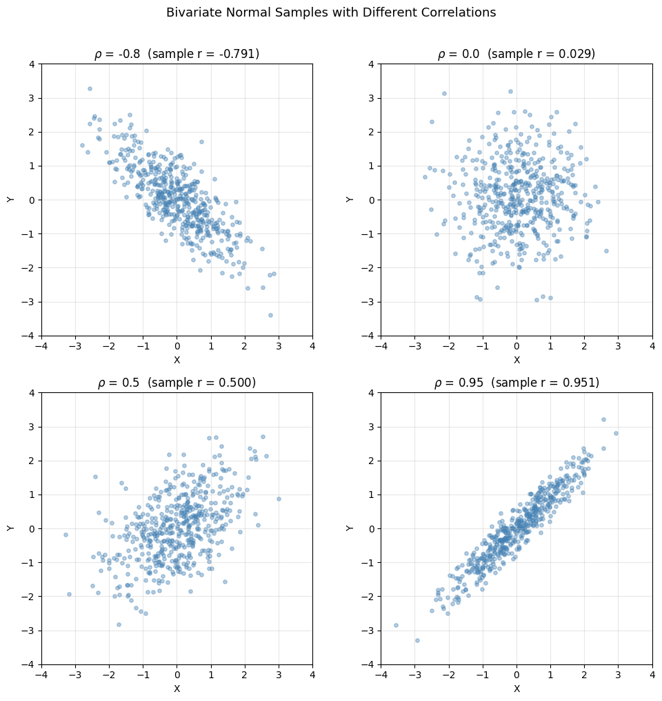

# 상관계수 모의실험

이 페이지에서는 상관계수 $\rho$ 가 두 확률변수의 결합분포를 어떻게 빚어내는지를 눈으로 보인다. 여러 $\rho$ 값에서 이변량정규 표본을 만들어 산점도로 그려 보면, 서로 다른 상관계수 값이 실제로 어떤 모습인지에 대한 시각적 직관을 얻을 수 있다.

---

## 배경

표준편차 $\sigma_X$ 와 $\sigma_Y$ 가 양수인 확률변수 $X$ 와 $Y$ 에 대하여 **피어슨 상관계수**는 다음과 같다.

$$
\rho(X, Y) = \frac{\text{Cov}(X, Y)}{\sigma_X \, \sigma_Y}
$$

여기서 $\text{Cov}(X, Y) = E[XY] - E[X]\,E[Y]$ 이다. 상관계수는 언제나 $-1 \leq \rho \leq 1$ 을 만족하며, 등호가 성립할 필요충분조건은 $Y$ 가 $X$ 의 완전한 선형함수인 것이다.

평균이 $\mu_X, \mu_Y$, 표준편차가 $\sigma_X, \sigma_Y$, 상관계수가 $\rho$ 인 **이변량정규**분포의 공분산행렬은 다음과 같다.

$$
\Sigma = \begin{pmatrix} \sigma_X^2 & \rho\,\sigma_X\,\sigma_Y \\ \rho\,\sigma_X\,\sigma_Y & \sigma_Y^2 \end{pmatrix}
$$

두 주변분포가 모두 표준정규분포이면($\mu = 0$, $\sigma = 1$) 이는 다음과 같이 간단해진다.

$$
\Sigma = \begin{pmatrix} 1 & \rho \\ \rho & 1 \end{pmatrix}
$$

이변량정규분포는 상관을 눈으로 보기에 더없이 좋은 본보기이다. 모상관계수 $\rho$ 가 결합밀도의 타원 등고선이 어떤 모양으로 어느 쪽으로 기울어지는지를 온전히 결정하기 때문이다.

---

## 코드

```python
"""Correlation Simulation: 산점도와 주변분포로 상관을 눈으로 본다."""
import numpy as np
import matplotlib.pyplot as plt


def main():
    np.random.seed(42)
    n_samples = 500

    # 서로 다른 상관계수로 이변량정규 표본을 만든다
    rho_values = [-0.8, 0.0, 0.5, 0.95]

    fig, axes = plt.subplots(2, 2, figsize=(10, 10))
    axes = axes.ravel()

    for i, rho in enumerate(rho_values):
        # 공분산행렬
        mu = np.array([0, 0])
        cov = np.array([[1, rho], [rho, 1]])

        # 표본을 만든다
        samples = np.random.multivariate_normal(mu, cov, size=n_samples)
        x, y = samples[:, 0], samples[:, 1]

        # 표본상관계수를 구한다
        r = np.corrcoef(x, y)[0, 1]

        # 산점도
        axes[i].scatter(x, y, alpha=0.4, s=15, color="steelblue")
        axes[i].set_xlabel("X")
        axes[i].set_ylabel("Y")
        axes[i].set_title(f"$\\rho$ = {rho}  (sample r = {r:.3f})")
        axes[i].set_xlim(-4, 4)
        axes[i].set_ylim(-4, 4)
        axes[i].set_aspect("equal")
        axes[i].grid(True, alpha=0.3)

    plt.suptitle("Bivariate Normal Samples with Different Correlations",
                 fontsize=13, y=1.01)
    plt.tight_layout()
    plt.savefig("correlation_simulation.png", dpi=150, bbox_inches="tight")
    plt.show()


if __name__ == "__main__":
    main()
```

---

## 실행 결과


*$\rho \in \{-0.8,\,0,\,0.5,\,0.95\}$ 에 대한 이변량정규 표본 500개의 산점도. $|\rho|$ 가 커질수록 점구름은 원에서 직선 쪽으로 무너져 내리고, $\rho$ 의 부호가 기울어지는 방향을 정한다.*

이 스크립트는 $\rho$ 값마다 하나씩, $2 \times 2$ 격자로 산점도를 그려 낸다.

| 그림 | 모상관계수 $\rho$ | 흔히 나오는 표본상관계수 $r$ | 눈에 보이는 모습 |
|:---:|:---:|:---:|:---|
| 왼쪽 위 | $-0.8$ | $\approx -0.81$ | 왼쪽 위에서 오른쪽 아래로 기운 좁은 타원 |
| 오른쪽 위 | $0.0$ | $\approx 0.01$ | 어느 방향으로도 치우치지 않은 둥근 구름 |
| 왼쪽 아래 | $0.5$ | $\approx 0.49$ | 왼쪽 아래에서 오른쪽 위로 기운 보통 굵기의 타원 |
| 오른쪽 아래 | $0.95$ | $\approx 0.95$ | 직선 $y = x$ 에 거의 붙은 매우 좁은 타원 |

각 그림의 제목에는 참값 $\rho$ 와 실제로 얻어진 표본상관계수 $r$ 이 함께 적혀 있다.

---

## 뜻풀이

산점도는 상관에 관한 몇 가지 중요한 사실을 드러내 준다.

1. **점구름의 모양.** $|\rho| \to 1$ 이 되면 이변량정규 등고선은 원($\rho = 0$)에서 가느다란 타원으로, 끝내는 직선($|\rho| = 1$)으로 무너진다. 산점도도 이를 그대로 비춘다. $|\rho|$ 가 커질수록 점들이 어떤 직선 둘레로 더 촘촘히 모인다.

2. **부호가 방향을 정한다.** $\rho$ 가 음수이면 큰 $X$ 값이 작은 $Y$ 값과 짝을 이루도록 구름이 기울고, 양수이면 두 변수가 함께 커지도록 기운다.

3. **표본상관계수는 모상관계수에 가깝다.** 표본이 $n = 500$ 개일 때 표본 $r$ 은 대개 참값 $\rho$ 와 $0.01$ 에서 $0.03$ 정도밖에 차이 나지 않는다. 표본이 크면 표본상관계수가 모상관계수에 가까워짐을 보여 준다.

4. **상관이 0이면 선형 경향이 없다.** $\rho = 0$ 에서는 구름이 거의 둥글고 어떤 선형 무늬도 보이지 않는다. 일반적으로는 이것이 독립을 뜻하지 않지만(여기서는 이변량정규이므로 $\rho = 0$ 이면 실제로 독립이다).

---

## 연습문제

**연습문제 1.** 공분산행렬 $\Sigma = \begin{pmatrix} 1 & \rho \\ \rho & 1 \end{pmatrix}$ 을 써서, 주변분포가 표준정규분포인 이변량정규분포에서 $\text{Cor}(X, Y) = \rho$ 임을 대수적으로 확인하여라.

??? success "연습문제 1 풀이"
    공분산행렬에서 $\text{Var}(X) = 1$, $\text{Var}(Y) = 1$, $\text{Cov}(X, Y) = \rho$ 이다. 정의에 따라 다음을 얻는다.

    $$
    \text{Cor}(X, Y) = \frac{\text{Cov}(X, Y)}{\sqrt{\text{Var}(X)\,\text{Var}(Y)}} = \frac{\rho}{\sqrt{1 \cdot 1}} = \rho
    $$

    $\square$

---

**연습문제 2.** 모의실험을 고쳐 표본을 $n = 500$ 개가 아니라 $n = 50$ 개로 하여라. 여러 번 돌려 보면서 표본상관계수 $r$ 이 실행마다 얼마나 흔들리는지 살펴보아라. $\rho = 0.5$ 이고 $n = 50$ 일 때 $r$ 의 표준오차는 대략 얼마인가?

??? success "연습문제 2 풀이"
    이변량정규 모형 아래에서 $n$ 이 크면 점근적 근사로 다음을 얻는다.

    $$
    \text{SE}(r) \approx \frac{1 - \rho^2}{\sqrt{n}}
    $$

    이 공식은 어디까지나 근사이다. $n$ 이 커야 하고, $r$ 의 점근정규성에 기대고 있으며(꼬리가 두꺼운 분포에서는 이것이 깨진다), $|\rho|$ 가 $1$ 에서 떨어져 있을 때 가장 잘 맞는다.

    $\rho = 0.5$ 이고 $n = 50$ 이면 다음과 같다.

    $$
    \text{SE}(r) \approx \frac{1 - 0.25}{\sqrt{50}} = \frac{0.75}{7.071} \approx 0.106
    $$

    그러므로 표본상관계수는 참값 $0.5$ 를 중심으로 대략 $\pm 0.1$ 안에서 흔들리며, $r$ 이 대충 $0.3$ 에서 $0.7$ 사이로 관측되는 일이 흔하다는 뜻이다. $n = 500$ 이면 표준오차가 약 $0.034$ 로 떨어지는데, 원래 모의실험이 훨씬 촘촘한 추정값을 주는 까닭이 여기에 있다.

---

**연습문제 3.** 상관계수가 $\rho$ 인 이변량정규분포에서 조건부분포 $Y \mid X = x$ 가 평균 $\mu_Y + \rho \frac{\sigma_Y}{\sigma_X}(x - \mu_X)$, 분산 $\sigma_Y^2(1 - \rho^2)$ 인 정규분포임을 증명하여라.

??? success "연습문제 3 풀이"
    이변량정규밀도는 다음과 같다.

    $$
    f(x, y) = \frac{1}{2\pi\sigma_X\sigma_Y\sqrt{1 - \rho^2}} \exp\!\left(-\frac{Q}{2(1 - \rho^2)}\right)
    $$

    여기서 $u = (x - \mu_X)/\sigma_X$, $v = (y - \mu_Y)/\sigma_Y$ 로 적으면 다음과 같다.

    $$
    Q = u^2 - 2\rho\,u\,v + v^2
    $$

    **1단계: $v$ 에 대하여 완전제곱을 만든다.** $u$ 를 고정된 값으로 보고 $v$ 가 들어간 항을 모으면 다음과 같다.

    $$
    Q = v^2 - 2\rho\,u\,v + u^2 = (v - \rho u)^2 + u^2 - \rho^2 u^2 = (v - \rho u)^2 + (1 - \rho^2)\,u^2
    $$

    **2단계: $2(1 - \rho^2)$ 로 나눈다.**

    $$
    \frac{Q}{2(1 - \rho^2)} = \frac{(v - \rho u)^2}{2(1 - \rho^2)} + \frac{u^2}{2}
    $$

    **3단계: 결합밀도를 분해한다.** 위 결과를 넣으면 다음과 같다.

    $$
    f(x, y) = \underbrace{\frac{1}{\sigma_X\sqrt{2\pi}} \exp\!\left(-\frac{u^2}{2}\right)}_{f_X(x)} \cdot \underbrace{\frac{1}{\sigma_Y\sqrt{2\pi(1 - \rho^2)}} \exp\!\left(-\frac{(v - \rho u)^2}{2(1 - \rho^2)}\right)}_{f(y \mid x)}
    $$

    두 번째 인수는 $y$ 에 대한 정규밀도이며, 평균과 분산을 곧바로 읽어 낼 수 있다.

    $$
    \mu_{Y\mid X} = \mu_Y + \sigma_Y \cdot \rho\,u = \mu_Y + \rho\,\frac{\sigma_Y}{\sigma_X}\,(x - \mu_X)
    $$

    $$
    \sigma_{Y\mid X}^2 = \sigma_Y^2(1 - \rho^2)
    $$

    $\square$

---

**연습문제 4.** 모의실험에서는 `np.corrcoef(x, y)[0, 1]` 로 $r$ 을 구한다. 이 함수가 실제로 계산하는 공식을 써 보고, 그것이 피어슨 표본상관계수

$$
r = \frac{\sum_{i=1}^n (x_i - \bar{x})(y_i - \bar{y})}{\sqrt{\sum_{i=1}^n (x_i - \bar{x})^2 \sum_{i=1}^n (y_i - \bar{y})^2}}
$$

와 같음을 자료 $x = (1, 2, 3, 4, 5)$ 와 $y = (2, 4, 5, 4, 5)$ 에 대하여 $r$ 을 손으로 구해 확인하여라.

??? success "연습문제 4 풀이"
    먼저 평균을 구한다. $\bar{x} = 3$, $\bar{y} = 4$ 이다.

    평균에서의 편차는 다음과 같다.

    $$
    x_i - \bar{x}: \quad -2, -1, 0, 1, 2
    $$

    $$
    y_i - \bar{y}: \quad -2, 0, 1, 0, 1
    $$

    분자는 다음과 같다.

    $$
    \sum (x_i - \bar{x})(y_i - \bar{y}) = (-2)(-2) + (-1)(0) + (0)(1) + (1)(0) + (2)(1) = 4 + 0 + 0 + 0 + 2 = 6
    $$

    분모를 이루는 값들은 다음과 같다.

    $$
    \sum (x_i - \bar{x})^2 = 4 + 1 + 0 + 1 + 4 = 10
    $$

    $$
    \sum (y_i - \bar{y})^2 = 4 + 0 + 1 + 0 + 1 = 6
    $$

    그러므로 다음을 얻는다.

    $$
    r = \frac{6}{\sqrt{10 \cdot 6}} = \frac{6}{\sqrt{60}} = \frac{6}{2\sqrt{15}} = \frac{3}{\sqrt{15}} \approx 0.7746
    $$

    이는 `np.corrcoef([1,2,3,4,5], [2,4,5,4,5])[0,1]` 의 값과 일치한다.

---

**연습문제 5.** 일반적으로 $\rho = 0$ 이 독립을 뜻하지 **않는** 까닭과, 이변량정규 확률변수에 대해서는 독립을 뜻**하는** 까닭을 설명하여라. 무상관이지만 독립이 아닌 확률변수의 예를 하나 들어라.

??? success "연습문제 5 풀이"
    **일반적인 경우.** 상관계수는 *선형* 연관만을 잰다. 두 변수가 $\rho = 0$ 이면서도 비선형 관계로 강하게 종속일 수 있으므로, 일반적으로 $\rho = 0$ 은 독립을 뜻하지 않는다.

    **이변량정규라는 특별한 경우.** 이변량정규분포의 결합밀도는 다음과 같다.

    $$
    f(x, y) = \frac{1}{2\pi\sigma_X\sigma_Y\sqrt{1 - \rho^2}} \exp\!\left(-\frac{Q}{2(1 - \rho^2)}\right)
    $$

    $\rho = 0$ 이면 이차형식이 다음과 같이 간단해지고

    $$
    Q = \left(\frac{x - \mu_X}{\sigma_X}\right)^2 + \left(\frac{y - \mu_Y}{\sigma_Y}\right)^2
    $$

    결합밀도가 $f(x, y) = f_X(x) \cdot f_Y(y)$ 로 분해되므로 $X$ 와 $Y$ 는 독립이다.

    **반례.** $X \sim \text{Uniform}(-1, 1)$ 이고 $Y = X^2$ 이라 하자. 그러면 $Y$ 는 $X$ 에 의해 완전히 정해지므로 둘은 종속이다. 그런데 $X^3$ 이 대칭인 확률변수의 기함수이므로 $\text{Cov}(X, Y) = E[X \cdot X^2] - E[X]\,E[X^2] = E[X^3] - 0 = 0$ 이다. 그러므로 완전히 종속인데도 $\rho(X, Y) = 0$ 이다.

---

**연습문제 6.** $(X, Y)$ 가 $\rho = 0.95$ 인 이변량정규분포를 따른다고 하자. $\text{Var}(Y \mid X = x)$ 가 $\text{Var}(Y)$ 의 몇 분의 몇인지 구하고, 그 결과를 산점도에 비추어 풀이하여라.

??? success "연습문제 6 풀이"
    이변량정규분포의 조건부분포(연습문제 3을 보라)에 따라 다음이 성립한다.

    $$
    \text{Var}(Y \mid X = x) = \sigma_Y^2(1 - \rho^2)
    $$

    주변분산에 대한 비로 나타내면 다음과 같다.

    $$
    \frac{\text{Var}(Y \mid X = x)}{\text{Var}(Y)} = 1 - \rho^2 = 1 - 0.95^2 = 1 - 0.9025 = 0.0975
    $$

    곧 조건부분산은 주변분산의 약 $9.75\%$ 밖에 되지 않는다. $X = x$ 를 알고 나면 $Y$ 에 남아 있는 불확실성이 크게 줄어든다는 뜻이다. 산점도에서는 주어진 $x$ 값에서 점들이 세로로 아주 좁게 퍼지는 모습으로 나타난다. 점구름이 회귀직선 $y = \mu_Y + \rho(x - \mu_X)$ 둘레로 바싹 조여드는 것인데, 이는 $\rho = 0.95$ 그림에서 실제로 보이는 모습 그대로이다.

---

**연습문제 7.** *비선형 반례를 눈으로 보기.* $X \sim \text{Uniform}(-1, 1)$ 에서 $n = 1000$ 개를 뽑고 $Y = X^2$ 으로 두는 모의실험을 하여라. 표본상관계수 $r$ 을 구하고 $(X, Y)$ 의 산점도를 그려라. $r \approx 0$ 인데도 점구름에 뚜렷한 모양이 나타나는 까닭을 설명하여라.

??? success "연습문제 7 풀이"
    가장 단순한 모의실험은 다음과 같다.

    ```python
    import numpy as np
    import matplotlib.pyplot as plt

    rng = np.random.default_rng(0)
    n = 1000
    x = rng.uniform(-1, 1, size=n)
    y = x**2

    r = np.corrcoef(x, y)[0, 1]

    plt.scatter(x, y, s=12, alpha=0.5, color="steelblue")
    plt.xlabel("X")
    plt.ylabel("Y = X^2")
    plt.title(f"Y = X^2 with sample r = {r:.3f}")
    plt.show()
    ```

    흔히 나오는 결과는 이렇다. $r$ 은 0에서 $\pm 0.05$ 안에 있는데도 산점도는 완벽한 포물선을 그린다. 모든 점이 정확히 $y = x^2$ 위에 놓이기 때문이다. 이 그림이 핵심 메시지를 눈에 보이게 해 준다.

    - $\rho = 0$ 은 **가장 잘 맞는 직선**에 관한 말이지, 구조가 없다는 말이 아니다.
    - 포물선은 $x = 0$ 을 축으로 대칭이므로 가장 잘 맞는 직선의 기울기가 0이다. $Y$ 가 $X$ 의 결정적 함수인데도 선형적인 방법은 이를 "아무 관계도 없음"으로 읽는다.

    이변량정규 모의실험의 $\rho = 0$ 그림과 견주어 보자. 거기서는 점구름이 정말로 아무 특징 없는 원이다. 둥근 구름과 결정적인 포물선이라는 이 대비가, $\rho = 0$ 이 독립과 같은 말이 아닌 까닭을 눈으로 보여 준다.
