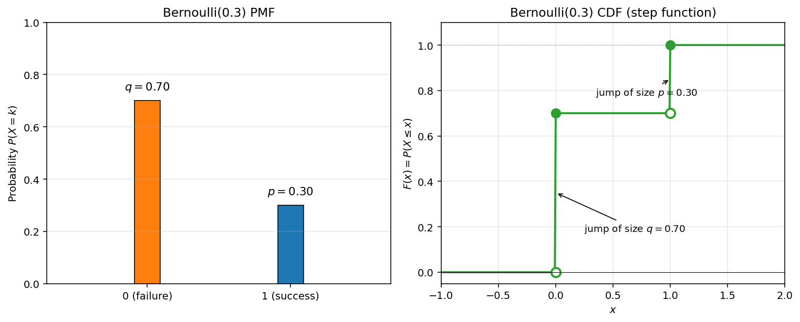

# 베르누이분포

## 왜 필요한가

현실의 많은 실험은 결과가 꼭 두 가지뿐이다. 동전은 앞면이 나오거나 뒷면이 나오고, 만들어진 부품은 불량이거나 아니고, 환자는 회복하거나 하지 못한다. **베르누이분포**는 이런 이분법적인 실험을 나타내는 가장 단순한 확률모형이다. 이 분포는 이 장의 나머지에서 다룰 이항분포, 기하분포, 음이항분포를 쌓아 올리는 벽돌이 된다.

## 정의

확률변수 $X$ 가 값을 두 가지만 가지며 다음을 만족하면, $X$ 는 모수가 $p \in [0, 1]$ 인 **베르누이분포**를 따른다고 하고 $X \sim \text{Bernoulli}(p)$ 로 적는다.

$$
P(X = 1) = p, \qquad P(X = 0) = 1 - p = q
$$

$X = 1$ 을 **성공**, $X = 0$ 을 **실패**라고 부른다. 이 장에서는 $q = 1 - p$ 라는 기호를 계속 쓴다.

!!! info "베르누이 확률질량함수"
    확률질량함수는 하나의 식으로 적을 수 있다.

    $$P(X = k) = p^k (1-p)^{1-k}, \quad k \in \{0, 1\}$$

---

## 평균과 분산

**평균.** $X$ 는 값을 두 가지만 가지므로 다음과 같다.

$$
E[X] = 0 \cdot q + 1 \cdot p = p
$$

**이차적률.** $X$ 는 0 아니면 1의 값만 가지므로 $X^2 = X$ 이고, 따라서 $E[X^2] = p$ 이다.

**분산.** 간편식을 적용하면 다음을 얻는다.

$$
\text{Var}(X) = E[X^2] - (E[X])^2 = p - p^2 = p(1 - p) = pq
$$

분산은 $p = 1/2$ 에서 가장 크고 그 값은 $\text{Var}(X) = 1/4$ 이며, 양 끝인 $p = 0$ 이나 $p = 1$ 에서는 0이 된다.

---

## 지시확률변수와의 관계

베르누이 확률변수는 다름 아닌 **지시확률변수**이다. $A$ 가 사건일 때 다음과 같이 두면

$$
I_A = \begin{cases} 1 & A \text{ 가 일어나면} \\ 0 & A \text{ 가 일어나지 않으면} \end{cases}
$$

$I_A \sim \text{Bernoulli}(P(A))$ 가 된다. 이 관계는 근본적이다. 여러 사건 가운데 몇 개가 일어났는지를 셀 때면 언제나 우리는 베르누이 확률변수를 더하고 있는 것이다.

---

## 누적분포함수

누적분포함수 $F(x) = P(X \le x)$ 는 다른 모든 이산확률변수에서와 마찬가지로 **계단함수**이다. 이 함수는 받침의 점들 사이에서는 평평하고 $X$ 가 가질 수 있는 값마다 뛰어오르며, 뛰는 높이는 그 점의 확률과 같다. $X \sim \text{Bernoulli}(p)$ 이면 다음과 같다.

$$
F(x) = \begin{cases} 0 & x < 0 \\ q & 0 \le x < 1 \\ 1 & x \ge 1 \end{cases}
$$

$x = 0$ 에서 크기 $q$ 만큼(확률 $P(X = 0)$), $x = 1$ 에서 크기 $p$ 만큼(확률 $P(X = 1)$) 뛴다. 뛴 높이를 모두 더하면 $q + p = 1$ 로 전체 확률이 된다.

*왼쪽: $\text{Bernoulli}(0.3)$ 의 확률질량함수. 일어날 수 있는 두 결과 자리에 막대가 하나씩 서 있고 높이는 각각 $q = 0.7$ 과 $p = 0.3$ 이다. 오른쪽: 이에 대응하는 누적분포함수. 받침의 점들 사이에서는 평평하고 각 점에서 그 점의 확률만큼 정확히 뛴다. 속이 찬 원은 뛰는 자리에서 실제로 갖는 값(오른쪽 연속)을 나타내고, 속이 빈 원은 왼쪽에서 다가갈 때의 극한값을 나타낸다.*

---

## 예제

**동전 던지기.** 공정한 동전을 한 번 던지고 앞면이면 $X = 1$ 이라 하자. 그러면 $X \sim \text{Bernoulli}(1/2)$ 이고 $E[X] = 1/2$, $\text{Var}(X) = 1/4$ 이다.

**품질 관리.** 어떤 공장에서 만드는 물건의 불량률이 3%이다. 무작위로 고른 물건이 불량이면 $X = 1$ 이라 하자. 그러면 $X \sim \text{Bernoulli}(0.03)$ 이고 $E[X] = 0.03$, $\text{Var}(X) = 0.03 \times 0.97 = 0.0291$ 이다.

**자유투.** 어떤 농구 선수가 자유투를 80% 성공시킨다. 다음 슛이 들어가면 $X = 1$ 이라 하자. 그러면 $X \sim \text{Bernoulli}(0.8)$ 이고 $E[X] = 0.8$, $\text{Var}(X) = 0.16$ 이다.

## 연습문제

**연습문제 1.** $X \sim \text{Bernoulli}(p)$ 라 하자. 모든 양의 정수 $n$ 에 대하여 $E[X^n] = p$ 임을 보여라.

??? success "연습문제 1 풀이"
    $X$ 는 $0$ 과 $1$ 의 값만 가지므로 모든 $n \ge 1$ 에 대하여 $X^n = X$ 이다. 그러므로 $E[X^n] = E[X] = p$ 이다. $\square$

---

**연습문제 2.** 공정한 주사위를 한 번 던진다. 나온 눈이 $3$ 의 배수이면 $X = 1$, 아니면 $X = 0$ 이라 하자.

(a) $X$ 의 분포와 그 모수를 밝혀라.

(b) $E[X]$, $\operatorname{Var}(X)$, $F(0.5)$ 를 구하여라.

??? success "연습문제 2 풀이"
    (a) $\{1, \ldots, 6\}$ 에서 $3$ 의 배수는 $\{3, 6\}$ 이므로 $P(X = 1) = 2/6 = 1/3$ 이다. 그러므로 $X \sim \text{Bernoulli}(1/3)$ 이다.

    (b) $E[X] = 1/3$ 이고 $\operatorname{Var}(X) = (1/3)(2/3) = 2/9$ 이다. $0 \le 0.5 < 1$ 이므로 누적분포함수는 $F(0.5) = q = 2/3$ 을 만족한다. $\square$

---

**연습문제 3.** $P(A) = 0.4$ 인 사건 $A$ 와 $P(B) = 0.6$ 인 사건 $B$ 가 있다고 하자. 이에 대응하는 지시확률변수를 $I_A$ 와 $I_B$ 라 하자.

(a) $E[I_A]$, $\operatorname{Var}(I_A)$, $E[I_B]$, $\operatorname{Var}(I_B)$ 를 구하여라.

(b) $A \cap B$ 의 지시확률변수를 $I_A$ 와 $I_B$ 로 나타내어라.

(c) $A$ 와 $B$ 가 독립일 때 $E[I_A I_B]$ 를 구하여라.

??? success "연습문제 3 풀이"
    (a) $E[I_A] = P(A) = 0.4$, $\operatorname{Var}(I_A) = 0.4 \cdot 0.6 = 0.24$ 이고, 마찬가지로 $E[I_B] = 0.6$, $\operatorname{Var}(I_B) = 0.24$ 이다.

    (b) 곱이 $1$ 이 될 필요충분조건은 두 지시확률변수가 모두 $1$ 인 것이므로 $I_{A \cap B} = I_A \cdot I_B$ 이다.

    (c) 독립성에 따라 $E[I_A I_B] = E[I_A] E[I_B] = 0.4 \cdot 0.6 = 0.24 = P(A \cap B)$ 이다. $\square$

---

**연습문제 4.** 어떤 희귀병에 대한 의학 검사의 민감도가 $99\%$, 특이도가 $98\%$ 라고 하자. 이 병의 인구 중 유병률은 $1\%$ 이다. 무작위로 고른 사람이 병에 걸렸으면 $D = 1$, 검사에서 양성이 나오면 $T = 1$ 이라 하자.

(a) $D$ 의 분포를 밝혀라.

(b) $P(T = 1) = 0.0297$ 임을 보여라(전확률 법칙을 쓰라).

??? success "연습문제 4 풀이"
    (a) $D \sim \text{Bernoulli}(0.01)$ 이다.

    (b) 전확률 법칙에 따라 다음을 얻는다.

    $$P(T = 1) = P(T = 1 \mid D = 1) P(D = 1) + P(T = 1 \mid D = 0) P(D = 0)$$

    $$= 0.99 \cdot 0.01 + 0.02 \cdot 0.99 = 0.0099 + 0.0198 = 0.0297$$

    $\square$

---

**연습문제 5.** 받침이 $\{0, 1\}$ 이고 평균이 $p$ 인 모든 분포 가운데 베르누이$(p)$ 분포가 분산을 가장 크게 만듦을 보여라.

??? success "연습문제 5 풀이"
    $\{0, 1\}$ 위에서 평균이 $p$ 인 분포는 $E[X] = P(X=1)$ 이므로 반드시 $P(X = 1) = p$ 를 만족해야 하고, 따라서 $\text{Bernoulli}(p)$ 일 수밖에 없다. 그러한 분포가 하나뿐이므로 "가장 크게 만든다"는 말은 자명하다. (이 문제는 평균 하나만으로 베르누이분포 전체가 정해진다는 점을 드러내려고 넣은 것이다.) $\square$
