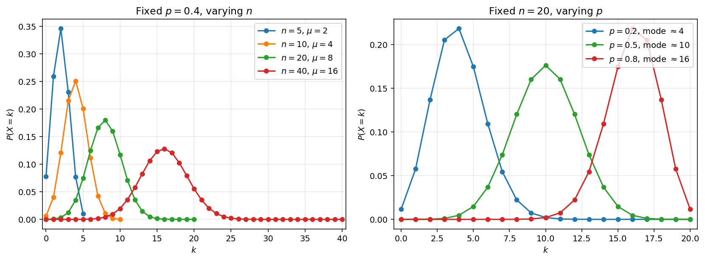

# 이항분포

## 왜 필요한가

성공확률이 $p$ 인 베르누이 실험을 서로 독립으로 $n$ 번 되풀이한다고 하자. 성공한 횟수의 총합은 **이항분포**를 따르는데, 이는 확률론과 통계학에서 가장 중요한 이산분포 가운데 하나이다.

## 정의

확률변수 $X$ 의 받침이 $\{0, 1, 2, \ldots, n\}$ 이고 확률질량함수가 다음과 같으면, $X$ 는 모수가 $n \in \{1, 2, \ldots\}$ 과 $p \in [0, 1]$ 인 **이항분포**를 따른다고 하고 $X \sim \text{Bin}(n, p)$ 로 적는다.

$$
P(X = k) = \binom{n}{k} p^k (1-p)^{n-k}, \quad k = 0, 1, \ldots, n
$$

여기서 $\binom{n}{k} = \frac{n!}{k!(n-k)!}$ 은 $n$ 번의 시행 가운데 어느 $k$ 번이 성공인지를 고르는 경우의 수이고, $p^k$ 는 $k$ 번 성공할 확률, $(1-p)^{n-k}$ 는 $n - k$ 번 실패할 확률이다.

!!! info "베르누이의 합으로 본 이항분포"
    $X_1, X_2, \ldots, X_n$ 이 서로 독립인 $\text{Bernoulli}(p)$ 확률변수이면 다음이 성립한다.

    $$S = X_1 + X_2 + \cdots + X_n \sim \text{Bin}(n, p)$$

    이것이 이항분포를 만들어 내는 바탕이 되는 구성이다. 베르누이분포는 $\text{Bin}(1, p)$ 라는 특별한 경우이다.

---

## 확인: 확률질량함수의 합은 1이다

이항정리에 따라 다음이 성립한다.

$$
\sum_{k=0}^{n} \binom{n}{k} p^k (1-p)^{n-k} = (p + (1-p))^n = 1^n = 1
$$

---

## 평균

베르누이 분해 $X = X_1 + \cdots + X_n$ 과 기댓값의 선형성을 쓰면 다음을 얻는다.

$$
E[X] = \sum_{i=1}^{n} E[X_i] = np
$$

이 유도에는 이항계수를 주무르는 대수 계산이 전혀 필요하지 않다. 기댓값의 선형성은 독립성을 요구하지 않기 때문이다.

---

## 분산

$X_i$ 들이 **독립**이므로 합의 분산은 분산의 합과 같다.

$$
\text{Var}(X) = \sum_{i=1}^{n} \text{Var}(X_i) = npq
$$

여기서 $q = 1 - p$ 이다.

!!! tip "독립성이 왜 중요한가"
    기댓값의 선형성은 독립이 아니어도 성립하므로 $E[X] = np$ 는 언제나 옳다. 그러나 $\text{Var}(X) = npq$ 는 시행들이 독립이라는 사실을 쓴 것이다. 시행들이 종속이면(예를 들어 비복원추출이면) 분산 공식이 달라진다. 초기하분포를 보라.

---

## 주요 성질

**최빈값.** $\text{Bin}(n, p)$ 의 확률질량함수는 **단봉**이다. $k$ 가 $0$ 에서 커짐에 따라 늘어나다가 꼭대기에 이르고, 그 뒤로는 $k = n$ 의 $0$ 을 향해 줄어든다. 꼭대기는 $k = (n+1)p$ 근처에서 나타나며, 더 정확히 말하면 가장 확률이 큰 값은 $\lfloor (n+1)p \rfloor$ 이다($(n+1)p$ 가 정수이면 $\lfloor (n+1)p \rfloor - 1$ 도 함께 최빈값이 되어 확률질량함수에 크기가 같은 꼭대기가 둘 생긴다). 연습문제 3에서 비 $P(X = k)/P(X = k-1)$ 로부터 이를 유도한다.

*왼쪽: $p = 0.4$ 로 고정하고 $n$ 을 키운 경우. 분포가 오른쪽으로 옮겨 가고(평균 $np$) 폭이 넓어진다(분산 $np(1-p)$). 오른쪽: $n = 20$ 으로 고정하고 $p$ 를 바꾼 경우. $p = 0.5$ 에서는 확률질량함수가 대칭이고, $p = 0.2$ 에서는 오른쪽으로 치우치며 최빈값이 $4$ 근처에, $p = 0.8$ 에서는 왼쪽으로 치우치며 최빈값이 $16$ 근처에 놓인다. 최빈값은 언제나 $(n+1)p$ 근처에 자리한다.*

**대칭성.** $X \sim \text{Bin}(n, p)$ 이면 $n - X \sim \text{Bin}(n, 1-p)$ 이다. 실패 횟수도 이항분포를 따른다.

**덧셈성.** $X \sim \text{Bin}(n, p)$ 와 $Y \sim \text{Bin}(m, p)$ 가 독립이면 다음이 성립한다.

$$
X + Y \sim \text{Bin}(n + m, p)
$$

이는 베르누이 분해에서 바로 나온다. 서로 독립인 두 베르누이 시행열을 이어 붙이면 더 긴 시행열이 되기 때문이다.

---

## 누적분포함수

$X \sim \text{Bin}(n, p)$ 의 누적분포함수는 다음과 같다.

$$
F(k) = P(X \le k) = \sum_{j = 0}^{k} \binom{n}{j} p^j (1-p)^{n-j}, \qquad k = 0, 1, \ldots, n
$$

이 부분합에는 닫힌 꼴이 없으므로, 실제로는 표나 수치 계산 소프트웨어(예를 들어 `scipy.stats.binom.cdf`)에 기대거나 $n$ 이 클 때에는 **정규근사**를 쓴다. 누적분포함수에 관한 두 항등식은 끊임없이 쓰인다.

- **오른쪽 꼬리.** $P(X \ge k) = 1 - F(k - 1)$.
- **대칭성.** $n - X \sim \text{Bin}(n, 1 - p)$ 에서 나오는 $F_{n, p}(k) = 1 - F_{n, 1-p}(n - k - 1)$.

누적분포함수는 모든 이산확률변수에서와 마찬가지로 계단함수이며, 각 정수 $k \in \{0, 1, \ldots, n\}$ 에서 크기 $P(X = k)$ 만큼 뛴다.

---

## 예제

**동전 던지기.** 공정한 동전을 10번 던진다. 앞면이 나온 횟수 $X \sim \text{Bin}(10, 0.5)$ 는 $E[X] = 5$, $\text{Var}(X) = 2.5$ 를 갖는다. 앞면이 정확히 7번 나올 확률은 다음과 같다.

$$
P(X = 7) = \binom{10}{7} (0.5)^{10} = \frac{120}{1024} \approx 0.117
$$

**품질 관리.** 물건 50개짜리 묶음의 불량률이 4%이다. 물건들을 서로 독립으로 검사한다면 불량품의 개수 $X \sim \text{Bin}(50, 0.04)$ 는 $E[X] = 2$, $\text{Var}(X) = 1.92$ 를 갖는다. 불량품이 하나도 없을 확률은 다음과 같다.

$$
P(X = 0) = (0.96)^{50} \approx 0.130
$$

**드문 사건 선별검사.** 유병률이 $p = 0.002$ 인 인구에서 $n = 1000$ 명에게 선별검사를 한다. $X$ 를 진짜 양성의 수라 하자. 그러면 $X \sim \text{Bin}(1000, 0.002)$ 이고 $E[X] = 2$, $\operatorname{Var}(X) = 1.996$ 이다. $n$ 이 큰데도 $p$ 가 작아서 평균은 크지 않다. $n$ 이 크고 $np$ 가 적당한 크기일 때 이항분포는 $\text{Poisson}(np)$ 분포로 잘 근사된다(다음 절에서 다룬다). 이것이 사기 탐지, 시스템 고장, 희귀병 선별검사처럼 드문 사건을 모형으로 삼을 때의 표준적인 상황이다.

## 연습문제

**연습문제 1.** 어떤 객관식 시험에 20문제가 있고 각 문제마다 선택지가 5개이다. 어떤 학생이 모든 문제를 무작위로 찍는다. $X$ 를 맞힌 문제의 개수라 하자.

(a) $X$ 의 분포는 무엇인가? 모수를 밝혀라.

(b) $E[X]$ 와 $\text{Var}(X)$ 를 구하여라.

(c) 여사건 규칙과 이항분포의 누적분포함수를 써서 $P(X \ge 8)$ 을 구하여라.

---

**연습문제 2.** $X \sim \text{Bin}(n, p)$ 와 $Y \sim \text{Bin}(m, p)$ 가 독립이라 하자. 베르누이 분해를 써서 $X + Y \sim \text{Bin}(n + m, p)$ 임을 증명하여라.

---

**연습문제 3.** 비 $P(X = k)/P(X = k - 1)$ 을 살펴봄으로써 $\text{Bin}(n, p)$ 의 최빈값이 $(n+1)p - 1 \le k^* \le (n+1)p$ 를 만족함을 보여라.

---

**연습문제 4.** 공정한 동전을 100번 던질 때 앞면이 나온 횟수의 분산은 얼마인가?

??? success "연습문제 4 풀이"
    $X$ 를 100번 던져 앞면이 나온 횟수라 하자. 그러면 $X \sim \text{Bin}(n = 100,\; p = 1/2)$ 이다. 이항분포를 따르는 확률변수의 분산은 다음과 같다.

    $$
    \text{Var}(X) = np(1 - p)
    $$

    값을 넣으면 다음을 얻는다.

    $$
    \text{Var}(X) = 100 \cdot \frac{1}{2} \cdot \frac{1}{2} = 25
    $$

    분산은 **25** 이다.

---

**연습문제 5.** 공정한 동전 9개를 던진다. $X$ 를 앞면의 개수라 하면 $X \sim \text{Bin}(9, 1/2)$ 이다. $P(X \text{ 가 홀수})$ 를 구하여라.

??? success "연습문제 5 풀이"
    짧은 길이 두 가지 있으며, 각각 서로 다른 도구를 비추어 준다.

    **대칭성을 쓰는 논법(우아한 길).** 어떤 결과에서 모든 동전을 뒤집는 것, 곧 H 를 모두 T 로, T 를 모두 H 로 바꾸는 것은 같은 정도로 일어나는 $2^9$ 개의 결과 위의 일대일대응이다. 이 대응은 앞면 개수의 홀짝을 뒤바꾼다. 앞면이 홀수인 결과는 앞면이 짝수인 결과로 옮겨 가고 그 반대도 마찬가지이다. 그러므로 이 대응은 앞면이 홀수인 결과들과 짝수인 결과들을 하나씩 짝지어 주며, 따라서 다음이 성립한다.

    $$P(X \text{ 가 홀수}) = P(X \text{ 가 짝수})$$

    두 사건이 표본공간을 나누어 덮으므로 각각의 확률은 $1/2$ 이다. **답:** $P(X \text{ 가 홀수}) = 1/2$.

    **이항정리를 쓰는 논법.** 확률질량함수에서 곧바로 다음을 얻는다.

    $$P(X \text{ 가 홀수}) = \frac{1}{2^9} \sum_{k \text{ 가 홀수}} \binom{9}{k}$$

    이항정리를 두 번 적용한다.

    $$(1 + 1)^9 = \sum_{k=0}^9 \binom{9}{k} = 2^9, \qquad (1 - 1)^9 = \sum_{k=0}^9 (-1)^k \binom{9}{k} = 0$$

    앞의 것에서 뒤의 것을 빼면 $k$ 가 짝수인 항은 지워지고 홀수인 항은 두 배가 된다.

    $$2 \sum_{k \text{ 가 홀수}} \binom{9}{k} = 2^9, \quad \text{그러므로} \quad \sum_{k \text{ 가 홀수}} \binom{9}{k} = 2^8$$

    따라서 $P(X \text{ 가 홀수}) = 2^8 / 2^9 = 1/2$ 이다.

    **일반화.** 두 논법 모두 깔끔하게 넓혀진다. $X \sim \text{Bin}(n, p)$ 에 대하여 이항정리 항등식 $\sum_k (-1)^k \binom{n}{k} p^k q^{n-k} = (q - p)^n$ 을 쓰면 다음을 얻는다.

    $$P(X \text{ 가 홀수}) = \frac{1 - (q - p)^n}{2}$$

    $p = 1/2$ 이면 $q - p = 0$ 이므로 답은 $n$ 과 상관없이 $1/2$ 로 줄어든다. 대칭성 논법이 공정한 동전 몇 개에 대해서든 통하는 것이다. 치우친 동전($p \neq 1/2$)에서는 홀짝의 확률이 $n$ 과 $p$ 에 따라 달라진다. $\square$
