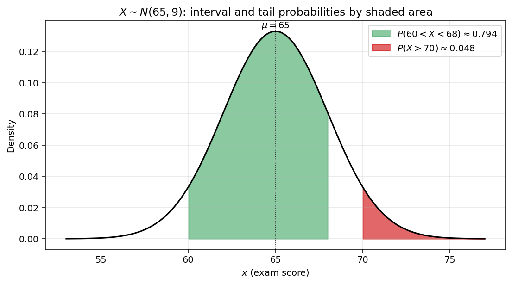
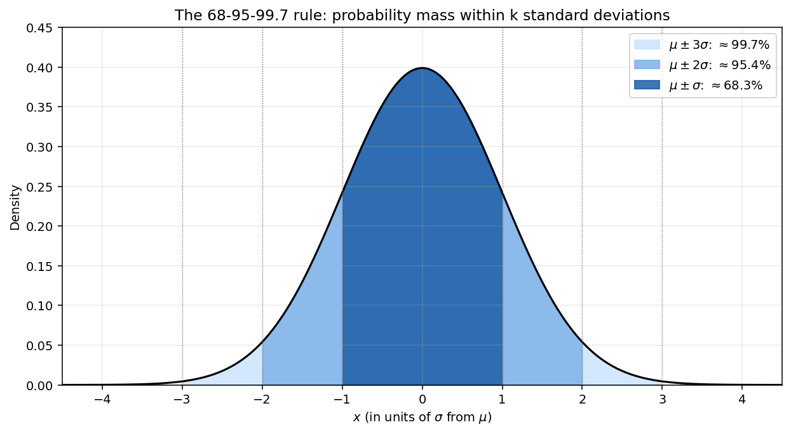

# 정규분포의 확률 계산

앞 절에서 표준정규분포의 누적분포함수와 Z-점수를 정의했으니, 이제 임의의 $X \sim N(\mu, \sigma^2)$ 에 대하여 확률과 백분위수를 실제로 계산하는 일을 다룬다. 이런 계산은 모두 똑같은 다섯 단계의 흐름을 따른다.

## 계산의 흐름

!!! tip "다섯 단계 흐름"
    $X \sim N(\mu, \sigma^2)$ 에 대한 어떤 확률 문제든 다음과 같이 푼다.

    1. **표준화한다.** 해당하는 Z-점수 $(x - \mu)/\sigma$ 를 계산한다.
    2. **그림을 그린다.** 종 모양 곡선을 그리고 관심 있는 영역을 색칠한다.
    3. **$\mathcal{N}$ 으로 나타낸다.** 확률을 표준정규분포의 누적분포함수로 다시 적는다.
    4. **대칭성과 여사건을 쓴다.** $z \geq 0$ 인 $\mathcal{N}(z)$ 로 줄인다.
    5. **찾아보고 계산한다.** 표나 수치 소프트웨어를 쓴다.

이 절의 나머지에서는 대표적인 세 가지 문제 유형에 이 흐름을 적용해 본다.

## 꼬리확률과 구간확률

$X \sim N(\mu, \sigma^2)$ 이고 표준화한 값이 $z_a = (a - \mu)/\sigma$, $z_b = (b - \mu)/\sigma$ 일 때 다음이 성립한다.

| 문제 | 공식 |
|------|---------|
| 왼쪽 꼬리 | $P(X \leq a) = \mathcal{N}(z_a)$ |
| 오른쪽 꼬리 | $P(X > a) = 1 - \mathcal{N}(z_a)$ |
| 구간 | $P(a < X < b) = \mathcal{N}(z_b) - \mathcal{N}(z_a)$ |
| 대칭인 구간 | $P(\mu - c < X < \mu + c) = 2\mathcal{N}(c/\sigma) - 1$ |

??? example "예: 시험 점수"
    시험 점수가 $X \sim N(65, 9)$ 를 따르므로 $\sigma = 3$ 이다.

    **(a) $P(X > 70)$ 을 구하여라.**

    표준화하면 $z = (70 - 65)/3 \approx 1.67$ 이다.

    $$P(X > 70) = 1 - \mathcal{N}(1.67) \approx 1 - 0.9525 = 0.0475$$

    학생의 약 $4.8\%$ 가 $70$ 점을 넘는다.

    **(b) $P(60 < X < 68)$ 을 구하여라.**

    표준화하면 $z_a = (60 - 65)/3 \approx -1.67$ 이고 $z_b = (68 - 65)/3 = 1$ 이다.

    $$P(60 < X < 68) = \mathcal{N}(1) - \mathcal{N}(-1.67) \approx 0.8413 - 0.0475 = 0.7938$$



*시험 점수 예제를 그림으로 본 것이다. 초록색으로 칠한 부분은 $P(60 < X < 68) \approx 0.794$(구간확률)이고, 빨간색으로 칠한 부분은 $P(X > 70) \approx 0.048$(오른쪽 꼬리)이다. 정규분포의 모든 확률은 해당 영역 위 종 모양 곡선 아래의 넓이이다. 흐름의 "그림을 그린다" 단계는 말 그대로 이 그림을 그리는 일이다.*

??? example "예: 제조 공차"
    어떤 기계가 길이 $X \sim N(50, 4)$ cm 인 막대를 만들어 내므로 $\sigma = 2$ 이다. 길이가 평균에서 $3$ cm 넘게 벗어난 막대는 걸러 낸다.

    걸러 내는 사건은 평균에 대하여 대칭이므로 다음이 성립한다.

    $$P(|X - 50| > 3) = 2 \bigl[1 - \mathcal{N}(3/2)\bigr] = 2 \bigl[1 - \mathcal{N}(1.5)\bigr] \approx 2(1 - 0.9332) = 0.1336$$

    막대의 약 $13.4\%$ 가 걸러진다.

## 68-95-99.7 규칙

쓸모 있는 어림 규칙이 하나 있다. $X \sim N(\mu, \sigma^2)$ 에 대하여 평균에서 표준편차 $k$ 개 안에 들어갈 확률은 다음과 같다.

$$P(|X - \mu| \leq k\sigma) = 2\mathcal{N}(k) - 1$$

| 구간 | 확률 |
|:---:|:---:|
| $\mu \pm \sigma$ | $\approx 0.6827$ |
| $\mu \pm 2\sigma$ | $\approx 0.9545$ |
| $\mu \pm 3\sigma$ | $\approx 0.9973$ |

이를 흔히 "$68\%$, $95\%$, $99.7\%$" 로 줄여 부르며, 어떤 값이 보통인지 드문지 극단적인지를 재빨리 가늠하는 잣대가 된다.



*68-95-99.7 규칙을 그림으로 본 것이다. 겹겹이 놓인 확률 띠에서 $\mu \pm \sigma$ 는 전체의 약 $68.3\%$, $\mu \pm 2\sigma$ 는 약 $95.4\%$, $\mu \pm 3\sigma$ 는 약 $99.7\%$ 를 품는다. $\pm 3\sigma$ 바깥의 확률은 $0.3\%$ 미만이며, 이는 "극단적인" 값을 가늠하는 쓸 만한 비공식 문턱값이다.*

## 백분위수 구하기

$P(X \leq x_\alpha) = \alpha$ 가 되는 값 $x_\alpha$ 를 구하려면 표준화를 거꾸로 돌린다.

$$x_\alpha = \mu + \sigma \cdot z_\alpha, \qquad \text{여기서 } \mathcal{N}(z_\alpha) = \alpha$$

??? example "예: 상위 10% 기준점"
    점수가 $N(65, 9)$ 를 따른다. 상위 $10\%$ 의 기준점 $c$ 는 $P(X > c) = 0.10$, 곧 $P(X \leq c) = 0.90$ 을 만족한다.

    $z_{0.90} \approx 1.282$ 를 찾아보면 다음을 얻는다.

    $$c = 65 + 3 \cdot 1.282 \approx 68.85$$

    점수가 $68.85$ 를 넘으면 상위 $10\%$ 에 든다.

## 파이썬 구현

```python
"""흐름을 따라가는 확률과 백분위수 계산."""

from scipy import stats

mu, sigma = 65, 3   # X ~ N(65, 9)

# === 구간확률 ===
p_interval = stats.norm.cdf(68, mu, sigma) - stats.norm.cdf(60, mu, sigma)
print(f"P(60 < X < 68) approx {p_interval:.4f}")

# === 위쪽 꼬리확률 ===
p_tail = 1 - stats.norm.cdf(70, mu, sigma)
print(f"P(X > 70)      approx {p_tail:.4f}")

# === 백분위수 / 상위 10% 기준점 ===
c_top10 = stats.norm.ppf(0.90, mu, sigma)
print(f"Top 10% cutoff approx {c_top10:.2f}")

# === 68-95-99.7 확인 ===
for k in [1, 2, 3]:
    p = stats.norm.cdf(k) - stats.norm.cdf(-k)
    print(f"P(|Z| <= {k}) approx {p:.4f}")
```

**실행 결과:**

```
P(60 < X < 68) approx 0.7936
P(X > 70)      approx 0.0478
Top 10% cutoff approx 68.84
P(|Z| <= 1) approx 0.6827
P(|Z| <= 2) approx 0.9545
P(|Z| <= 3) approx 0.9973
```

## 연습문제

**연습문제 1.**
$X \sim N(100, 225)$ 라 하자(따라서 $\sigma = 15$). $P(80 < X < 115)$ 를 구하여라.

??? success "연습문제 1 풀이"
    표준화하면 $z_a = (80 - 100)/15 \approx -1.33$ 이고 $z_b = (115 - 100)/15 = 1$ 이다.

    $$P(80 < X < 115) = \mathcal{N}(1) - \mathcal{N}(-1.33) \approx 0.8413 - 0.0918 = 0.7495$$

    $\square$

---

**연습문제 2.**
IQ 점수가 $N(100, 15^2)$ 을 따른다. $99$ 번째 백분위수에 해당하는 IQ 점수는 얼마인가?

??? success "연습문제 2 풀이"
    $z_{0.99} \approx 2.326$ 을 찾아보면 다음을 얻는다.

    $$x_{0.99} = 100 + 15 \cdot 2.326 \approx 134.9$$

    IQ 약 $135$ 가 $99$ 번째 백분위수이다. $\square$

---

**연습문제 3.**
어떤 충전 기계가 평균 $500$ ml, 표준편차 $5$ ml 로 병을 채운다(정규분포를 따른다). 내용물이 $490$ ml 와 $510$ ml 사이인 병은 전체의 몇 퍼센트인가?

??? success "연습문제 3 풀이"
    표준화하면 $z_a = -2$, $z_b = 2$ 이다.

    $$P(490 < X < 510) = \mathcal{N}(2) - \mathcal{N}(-2) = 2\mathcal{N}(2) - 1 \approx 0.9545$$

    약 $95.45\%$ 의 병이 이 범위에 들어간다. 68-95-99.7 규칙의 "$95\%$" 가 바로 이것이다. $\square$

---

**연습문제 4.**
$X \sim N(\mu, \sigma^2)$ 에 대하여 $P(\mu - c < X < \mu + c) = 0.80$ 이 되는 $c$ 를 구하여라.

??? success "연습문제 4 풀이"
    $$P(\mu - c < X < \mu + c) = 2\mathcal{N}(c/\sigma) - 1 = 0.80$$

    이므로 $\mathcal{N}(c/\sigma) = 0.90$ 이다. 표에서 $c/\sigma \approx 1.282$ 이므로 $c \approx 1.282\sigma$ 이다. $\square$

---

**연습문제 5.**
어떤 공장이 $X \sim N(\mu, \sigma^2)$ 인 막대를 내보낸다. 규격 한계는 $\mu \pm 2\sigma$ 이다. 공정을 개선하여 $\sigma$ 가 $0.5$ mm 에서 $0.3$ mm 로 줄었지만 규격 한계는 $\mu \pm 1$ mm 로 그대로이다. 불량률은 몇 배로 줄어드는가?

??? success "연습문제 5 풀이"
    개선 전: $\mu \pm 1$ 바깥에서 걸러지므로 $|Z| > 1/0.5 = 2$ 일 때이고, 따라서 다음을 얻는다.

    $$P_{\text{개선 전}} = 2[1 - \mathcal{N}(2)] \approx 2(1 - 0.9772) = 0.0455$$

    개선 후: $|Z| > 1/0.3 \approx 3.33$ 이므로 다음을 얻는다.

    $$P_{\text{개선 후}} = 2[1 - \mathcal{N}(3.33)] \approx 2(1 - 0.99957) = 0.00087$$

    줄어드는 배수는 $\approx 0.0455 / 0.00087 \approx 52$ 이다. 불량률이 $50$ 배 넘게 떨어진다. $\square$
