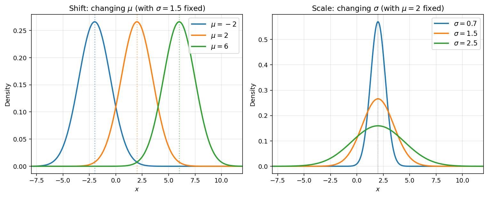
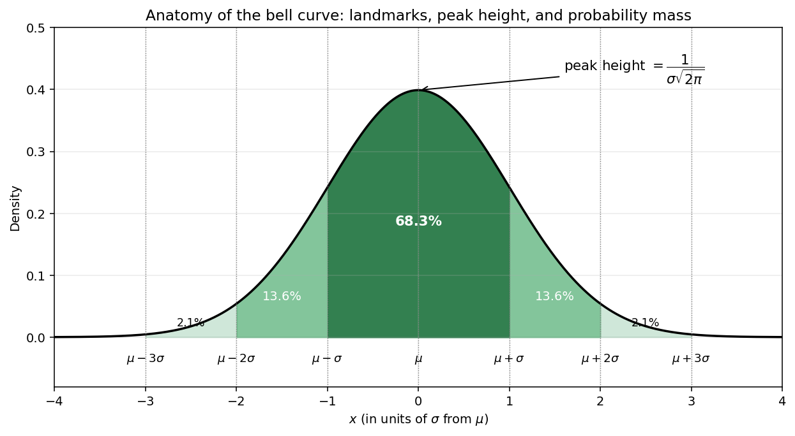

# 정규분포의 정의

정규분포(가우스분포)는 확률론과 통계학에서 가장 중요한 단 하나의 분포이다. 중심극한정리에서 자연스럽게 나타나고, 측정 오차와 여러 물리 현상을 나타내는 모형이 되며, 신뢰구간과 가설검정, 회귀분석의 바탕이 된다. 이 절에서는 밀도함수를 소개하고 이 장 전체에서 쓸 기호를 정한 뒤, 모수의 이름이 정당함을 보여 주는 두 가지 사실($\int f = 1$ 과 적률 항등식 $E[X] = \mu$, $\operatorname{Var}(X) = \sigma^2$)을 유도한다.

## N(μ, σ²) 의 확률밀도함수

평균이 $\mu$ 이고 분산이 $\sigma^2$ 인 **정규분포**(가우스분포)의 확률밀도함수는 다음과 같다.

$$f(x) = \frac{1}{\sqrt{2\pi\sigma^2}} \, e^{-\frac{(x - \mu)^2}{2\sigma^2}}, \quad -\infty < x < \infty$$

### 모수

| 모수 | 뜻 |
|-----------|---------|
| $\mu$ | 평균(종 모양 곡선의 중심) |
| $\sigma^2$ | 분산(퍼짐의 정도를 정한다) |
| $\sigma$ | 표준편차 |

이 책에서는 $X \sim N(\mu, \sigma^2)$ 으로 적으며, **두 번째 모수는 표준편차가 아니라 분산**이다.

!!! info "기호 약속"
    이 장 전체에서 다음 기호를 쓴다.

    - $N(\mu, \sigma^2)$ — 평균이 $\mu$ 이고 분산이 $\sigma^2$ 인 정규분포
    - $\phi(x) = \frac{1}{\sqrt{2\pi}} e^{-x^2/2}$ — 표준정규분포 $N(0,1)$ 의 확률밀도함수
    - $\mathcal{N}(x) = \int_{-\infty}^{x} \phi(s)\,ds$ — 표준정규분포의 누적분포함수

    보통 글꼴의 $N$ 은 분포를 나타내고 필기체 $\mathcal{N}$ 은 표준정규분포의 누적분포함수를 나타낸다. 둘은 서로 다른 대상이다.

### 직관

여러 개의 작고 독립인 효과를 더하거나 평균하면 대체로 정규분포에 가까워진다. 그래서 정규분포는 자연과 통계 곳곳에 나타난다. 이 현상을 정확하게 다듬은 것이 중심극한정리이며, 뒤의 장에서 다룬다.

### 모수가 미치는 영향

- $\mu$ 를 바꾸면 종 모양 곡선이 모양은 그대로인 채 왼쪽이나 오른쪽으로 **옮겨 간다**.
- $\sigma$ 를 키우면 곡선이 **넓고 낮아진다**(더 퍼진다).
- $\sigma$ 를 줄이면 곡선이 **좁고 높아진다**(더 모인다).



*왼쪽: $\mu$ 를 바꾸면 같은 종 모양 곡선이 일그러짐 없이 $x$ 축을 따라 미끄러진다. 오른쪽: $\sigma$ 를 바꾸면 곡선의 중심은 $\mu$ 에 그대로 있지만 곡선이 늘어나거나 눌린다. 봉우리의 높이는 $1/\sigma$ 에 비례해 바뀌므로 전체 넓이는 $1$ 로 유지된다.*



*종 모양 곡선의 해부. 봉우리는 $\mu$ 에서 높이 $1/(\sigma\sqrt{2\pi})$ 로 나타난다. 색칠한 띠는 확률의 크기를 보여 준다. $\pm\sigma$ 안에 약 $68.3\%$, 그 바깥 양쪽 $\sigma$ 띠에 각각 $13.6\%$, $2\sigma$–$3\sigma$ 띠에 각각 $2.1\%$ 가 들어 있다. 점 $\mu \pm \sigma$ 는 곡선의 변곡점이기도 하다.*

## 표준정규분포 N(0, 1)

**표준정규분포**는 $\mu = 0$, $\sigma = 1$ 인 경우이다.

$$\phi(x) = \frac{1}{\sqrt{2\pi}} \, e^{-x^2/2}$$

그 누적분포함수

$$\mathcal{N}(x) = \int_{-\infty}^{x} \phi(s)\,ds$$

는 닫힌 꼴로 적을 수 없다. 값은 수치적으로 계산하거나 표준정규분포표에서 읽는다. $\mathcal{N}$ 을 바탕으로 하는 확률과 분위수 계산은 다음 두 절에서 다룬다.

## 전체 넓이가 1임을 확인하기

$\phi$ 의 적분이 $1$ 임을 확인하자. 다음과 같이 놓자.

$$I = \int_{-\infty}^{\infty} e^{-x^2/2}\,dx$$

제곱한 뒤 $x = r\cos\theta$, $y = r\sin\theta$ 로 극좌표로 바꾸면 다음을 얻는다.

$$I^2 = \int_{-\infty}^{\infty}\!\!\int_{-\infty}^{\infty} e^{-(x^2 + y^2)/2}\,dx\,dy = \int_0^{2\pi}\!\!\int_0^{\infty} e^{-r^2/2}\,r\,dr\,d\theta$$

안쪽 적분은 $\bigl[-e^{-r^2/2}\bigr]_0^{\infty} = 1$ 이고 바깥 적분은 $2\pi$ 라는 인수를 준다. 따라서 다음이 성립한다.

$$I^2 = 2\pi, \qquad I = \sqrt{2\pi}$$

그러므로 $\int_{-\infty}^{\infty} \phi(x)\,dx = 1$ 이다.

### 표준정규분포로 되돌리기

일반적인 정규분포의 확률밀도함수도 변수변환으로 표준정규분포의 경우로 되돌리면 적분이 $1$ 임을 보일 수 있다. $f(x) = \frac{1}{\sqrt{2\pi\sigma^2}} e^{-(x - \mu)^2/(2\sigma^2)}$ 에 대하여 다음과 같이 치환한다.

$$z = \frac{x - \mu}{\sigma}, \qquad dx = \sigma\,dz$$

적분 구간 $x \in (-\infty, \infty)$ 는 $z \in (-\infty, \infty)$ 로 옮겨 가므로 다음을 얻는다.

$$\int_{-\infty}^{\infty} f(x)\,dx = \int_{-\infty}^{\infty} \frac{1}{\sqrt{2\pi\sigma^2}} e^{-z^2/2} \cdot \sigma\,dz = \int_{-\infty}^{\infty} \frac{1}{\sqrt{2\pi}} e^{-z^2/2}\,dz = \int_{-\infty}^{\infty} \phi(z)\,dz = 1$$

$dx = \sigma\,dz$ 에서 나온 $\sigma$ 가 $\sqrt{2\pi\sigma^2}$ 의 분모에 있는 $\sigma$ 와 약분되어 표준정규분포의 피적분함수만 남는다. 이 변수변환 요령은 이 장에서 일반적인 정규분포를 다룰 때마다 쓰는 본보기이다. 곧 $z = (x - \mu)/\sigma$ 로 $N(0,1)$ 로 되돌리는 것이다.

## N(μ, σ²) 의 평균과 분산

이제 모수 $\mu$ 와 $\sigma^2$ 이 정말로 평균과 분산인지 확인하자.

### 평균

$X \sim N(\mu, \sigma^2)$ 에 대하여 적분 안에서 $x = (x - \mu) + \mu$ 로 적는다.

$$E[X] = \int_{-\infty}^{\infty} x f(x)\,dx = \int_{-\infty}^{\infty} (x - \mu) f(x)\,dx + \mu \int_{-\infty}^{\infty} f(x)\,dx$$

$(x - \mu)f(x)$ 가 $x = \mu$ 에 대하여 기함수이므로 첫 적분은 사라지고, 둘째 적분은 $1$ 이다. 따라서 다음이 성립한다.

$$E[X] = \mu$$

### 분산

$z = (x - \mu)/\sigma$ 로 치환하면 $dx = \sigma\,dz$ 이므로 다음을 얻는다.

$$\operatorname{Var}(X) = E[(X - \mu)^2] = \int_{-\infty}^{\infty} (x - \mu)^2 f(x)\,dx = \sigma^2 \int_{-\infty}^{\infty} z^2 \phi(z)\,dz$$

이제 $\int z^2 \phi(z)\,dz = 1$ 임을 보이면 된다. $u = z$, $dv = z e^{-z^2/2}\,dz$ 로 놓고($du = dz$, $v = -e^{-z^2/2}$) 부분적분을 하면 다음을 얻는다.

$$\int_{-\infty}^{\infty} z^2 \phi(z)\,dz = \frac{1}{\sqrt{2\pi}} \left(\bigl[-z e^{-z^2/2}\bigr]_{-\infty}^{\infty} + \int_{-\infty}^{\infty} e^{-z^2/2}\,dz\right) = 0 + 1 = 1$$

따라서 다음이 성립한다.

$$\operatorname{Var}(X) = \sigma^2$$

특히 표준정규분포 $Z \sim N(0,1)$ 에 대해서는 $E[Z] = 0$ 과 $\operatorname{Var}(Z) = 1$ 을 얻는다.

## 적률생성함수

$X \sim N(\mu, \sigma^2)$ 에 대하여 지수의 완전제곱을 만들면 다음을 얻는다.

$$M_X(t) = E[e^{tX}] = \exp\!\left(\mu t + \tfrac{1}{2}\sigma^2 t^2\right)$$

이 적률생성함수는 다음 절들에서 합과 일차결합을 다룰 때 핵심 도구가 된다.

## 파이썬 구현

```python
"""정규분포의 확률밀도함수를 그리고 평균과 분산을 수치적으로 확인한다."""

import numpy as np
from scipy import stats

# === 표준정규분포 확률밀도함수의 적분이 1임을 확인한다 ===
x = np.linspace(-10, 10, 100001)
phi = stats.norm.pdf(x)
print(f"Integral of phi(x): {np.trapz(phi, x):.6f}")

# === N(mu, sigma^2) 의 평균과 분산을 확인한다 ===
mu, sigma = 3.0, 2.0
X = stats.norm.rvs(loc=mu, scale=sigma, size=1_000_000, random_state=0)
print(f"Sample mean:     {X.mean():.4f}  (expected {mu})")
print(f"Sample variance: {X.var():.4f}  (expected {sigma**2})")
```

**실행 결과:**

```
Integral of phi(x): 1.000000
Sample mean:     3.0014  (expected 3.0)
Sample variance: 4.0033  (expected 4.0)
```

## 연습문제

**연습문제 1.**
$X \sim N(\mu, \sigma^2)$ 에 대하여 $E[X^2]$ 을 다음 두 가지 방법으로 직접 구하여라.

(a) 분산 항등식 $\operatorname{Var}(X) = E[X^2] - (E[X])^2$ 을 쓴다.

(b) $X^2 = (X - \mu)^2 + 2\mu(X - \mu) + \mu^2$ 으로 적고 항마다 적분한다.

??? success "연습문제 1 풀이"
    (a) $E[X] = \mu$ 이고 $\operatorname{Var}(X) = \sigma^2$ 이므로 $E[X^2] = \sigma^2 + \mu^2$ 이다.

    (b) 기댓값을 취하면 다음을 얻는다.

    $$E[X^2] = E[(X-\mu)^2] + 2\mu E[X-\mu] + \mu^2 = \sigma^2 + 0 + \mu^2 = \sigma^2 + \mu^2$$

    두 방법의 답이 일치한다. $\square$

---

**연습문제 2.**
다음 적분 안에서 완전제곱을 만들어 $X \sim N(\mu, \sigma^2)$ 의 적률생성함수를 유도하여라.

$$M_X(t) = \int_{-\infty}^{\infty} e^{tx} \frac{1}{\sqrt{2\pi\sigma^2}} e^{-(x-\mu)^2/(2\sigma^2)}\,dx$$

??? success "연습문제 2 풀이"
    지수는 다음과 같다.

    $$tx - \frac{(x-\mu)^2}{2\sigma^2} = -\frac{1}{2\sigma^2}\Bigl[(x - \mu)^2 - 2\sigma^2 t x\Bigr]$$

    완전제곱을 만들면 $(x - \mu - \sigma^2 t)^2 - 2\sigma^2 \mu t - \sigma^4 t^2$ 이 되므로 지수는 다음과 같이 바뀐다.

    $$\mu t + \tfrac{1}{2}\sigma^2 t^2 - \frac{(x - \mu - \sigma^2 t)^2}{2\sigma^2}$$

    남은 적분은 $N(\mu + \sigma^2 t, \sigma^2)$ 의 확률밀도함수를 적분한 것이므로 $1$ 이다. 따라서 다음을 얻는다.

    $$M_X(t) = e^{\mu t + \frac{1}{2}\sigma^2 t^2}$$

    $\square$

---

**연습문제 3.**
완전제곱과 정규분포의 확률밀도함수를 써서 다음 적분을 계산하여라.

$$\int_{-\infty}^{\infty} e^{-x^2 - 2x}\,dx$$

??? success "연습문제 3 풀이"
    완전제곱을 만들면 $-x^2 - 2x = -(x+1)^2 + 1$ 이다. 따라서 다음을 얻는다.

    $$\int_{-\infty}^{\infty} e^{-x^2 - 2x}\,dx = e \int_{-\infty}^{\infty} e^{-(x+1)^2}\,du$$

    $u = x + 1$ 로 놓고 $\int_{-\infty}^{\infty} e^{-u^2}\,du = \sqrt{\pi}$ 를 쓰면 답은 $e\sqrt{\pi}$ 이다. $\square$
    
---

**연습문제 4.** 다음 적분을 계산하여라.

$$
\int_{-\infty}^{\infty} e^x\, e^{-(x - 1)^2}\, dx
$$

지수에서 완전제곱을 만든 뒤, 그 결과로 나온 피적분함수가 상수배만큼 다른 정규분포의 밀도함수임을 알아보는 방식으로 풀어라. 

??? success "연습문제 4 풀이"
    **지수를 합친다:**

    $$
    x - (x - 1)^2 = x - (x^2 - 2x + 1) = -x^2 + 3x - 1
    $$

    **완전제곱을 만든다:**

    $$
    -x^2 + 3x - 1 = -\!\left(x - \tfrac{3}{2}\right)^{\!2} + \tfrac{9}{4} - 1 = -\!\left(x - \tfrac{3}{2}\right)^{\!2} + \tfrac{5}{4}
    $$

    **상수를 밖으로 빼낸다:**

    $$
    \int_{-\infty}^{\infty} e^x\, e^{-(x - 1)^2}\, dx = e^{5/4} \int_{-\infty}^{\infty} e^{-(x - 3/2)^2}\, dx
    $$

    **정규분포의 밀도함수를 알아본다.** $e^{-(x - 3/2)^2}$ 를 정규분포 밀도함수의 지수 $e^{-(x - \mu)^2 / (2\sigma^2)}$ 와 견주면 $\mu = \tfrac{3}{2}$ 이고 $2\sigma^2 = 1$ 이므로 $\sigma = 1/\sqrt{2}$ 이고 정규화 상수는 $1/(\sigma\sqrt{2\pi}) = 1/\sqrt{\pi}$ 이다. 본문 §1.1의 항등식(정규분포의 밀도함수의 적분이 $1$ 이다)에 따라 다음이 성립한다.

    $$
    \int_{-\infty}^{\infty} e^{-(x - 3/2)^2}\, dx = \sqrt{\pi} \int_{-\infty}^{\infty} \frac{1}{\sqrt{\pi}}\, e^{-(x - 3/2)^2}\, dx = \sqrt{\pi}
    $$

    곧 가우스적분을 따로 계산할 필요가 없다.

    따라서 다음을 얻는다.

    $$
    \int_{-\infty}^{\infty} e^x\, e^{-(x - 1)^2}\, dx = \sqrt{\pi}\, e^{5/4}
    $$

