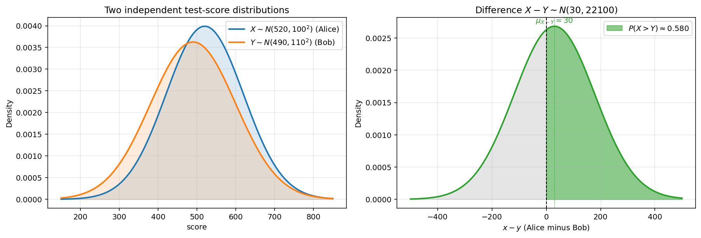

# 정규확률변수의 일차결합

앞 절의 합에 대한 결과는 훨씬 더 일반적인 사실의 특별한 경우이다. 곧 독립인 정규확률변수의 어떤 일차결합도 그 자체로 정규분포를 따른다. 여기에 평행이동과 크기 조절까지 더하면, 정규성이 일차 연산을 거쳐 어떻게 이어지는지 온전한 그림을 얻는다.

## 일반적인 일차결합

!!! info "일차결합 정리"
    $X_i \sim N(\mu_i, \sigma_i^2)$ 인 $X_1, \ldots, X_n$ 이 **독립**이고 $a_1, \ldots, a_n$ 이 상수이면 다음이 성립한다.

    $$\sum_{i=1}^n a_i X_i \sim N\!\left(\sum_{i=1}^n a_i \mu_i, \; \sum_{i=1}^n a_i^2 \sigma_i^2\right)$$

정규확률변수의 합에 대한 결과는 모든 $i$ 에 대하여 $a_i = 1$ 인 경우이다.

### 적률생성함수를 이용한 증명

$X_i \sim N(\mu_i, \sigma_i^2)$ 에 대하여 $M_{X_i}(t) = e^{\mu_i t + \frac{1}{2}\sigma_i^2 t^2}$ 이다. 독립성을 쓰면 다음을 얻는다.

$$M_{\sum a_i X_i}(t) = \prod_{i=1}^n M_{X_i}(a_i t) = \prod_{i=1}^n e^{\mu_i (a_i t) + \frac{1}{2} \sigma_i^2 (a_i t)^2}$$

$$= \exp\!\left(\Bigl(\sum a_i \mu_i\Bigr) t + \tfrac{1}{2} \Bigl(\sum a_i^2 \sigma_i^2\Bigr) t^2\right)$$

이것은 $N\!\left(\sum a_i \mu_i, \sum a_i^2 \sigma_i^2\right)$ 의 적률생성함수이다. 적률생성함수의 유일성에서 결과가 따라 나온다. $\square$

## 아핀변환

변수가 하나인 경우($n = 1$)는 워낙 자주 쓰이므로 따로 적어 둘 만하다.

!!! info "아핀변환"
    $X \sim N(\mu, \sigma^2)$ 이고 $a, b$ 가 상수이면 다음이 성립한다.

    $$aX + b \sim N(a\mu + b, \, a^2 \sigma^2)$$

몸에 익혀 둘 점이 두 가지 있다.

- 상수 $b$ 를 더하면 평균은 옮겨 가지만 분산은 **달라지지 않는다**.
- $a$ 배를 하면 평균은 $a$ 배가 되지만 분산은 $a^2$ 배가 된다. 곧 분산은 크기에 대해 이차이다.

표준화 $Z = (X - \mu)/\sigma$ 는 $a = 1/\sigma$, $b = -\mu/\sigma$ 인 아핀변환이다.

## 독립인 정규확률변수의 차

자주 쓰는 특별한 경우는 $X - Y$ 이다($a_1 = 1$, $a_2 = -1$ 로 두면 된다).

!!! info "독립인 정규확률변수의 차"
    $X \sim N(\mu_X, \sigma_X^2)$ 와 $Y \sim N(\mu_Y, \sigma_Y^2)$ 가 독립이면 다음이 성립한다.

    $$X - Y \sim N(\mu_X - \mu_Y, \; \sigma_X^2 + \sigma_Y^2)$$

빼는 연산인데도 분산은 **더해진다**. 독립인 확률변수에 대해 $\operatorname{Var}(X - Y) = \operatorname{Var}(X) + \operatorname{Var}(Y)$ 이기 때문이다.

## 풀이 예제

??? example "예: 시험 점수 견주기"
    앨리스의 점수는 $X \sim N(520, 100^2)$ 이고, 이와 독립으로 밥의 점수는 $Y \sim N(490, 110^2)$ 이다. 앨리스가 밥보다 점수가 높을 확률은 $P(X > Y) = P(X - Y > 0)$ 이다.

    차를 구하면 다음과 같다.

    $$X - Y \sim N(520 - 490, \; 100^2 + 110^2) = N(30, \; 22100)$$

    $\sqrt{22100} \approx 148.66$ 임에 유의하며 표준화하면 다음을 얻는다.

    $$P(X > Y) = 1 - \mathcal{N}\!\left(\frac{0 - 30}{148.66}\right) = \mathcal{N}\!\left(\frac{30}{148.66}\right) = \mathcal{N}(0.202) \approx 0.580$$

    앨리스가 더 높은 점수를 받을 확률은 약 $58\%$ 이다.



*독립인 정규확률변수의 차. 왼쪽: 앨리스의 $X \sim N(520, 100^2)$ 와 밥의 $Y \sim N(490, 110^2)$ 는 크게 겹친다. 평균은 $30$ 만큼 차이 나지만 각각의 표준편차가 $100$ 언저리이기 때문이다. 오른쪽: $X - Y \sim N(30, \,22100)$ 이다. 초록색 영역 $\{x - y > 0\}$ 의 넓이가 $\approx 0.580$ 이므로 앨리스가 이길 확률은 약 $58\%$ 이다. 차의 분포가 원래의 두 분포보다 더 넓다는 점에 눈길을 주자(분산이 빼지는 것이 아니라 더해지기 때문이다).*

??? example "예: 자산 묶음의 수익률"
    어떤 투자자가 연수익률이 $R_A \sim N(0.08, 0.04^2)$ 인 자산 $A$ 에 \$60{,}000 를, 수익률이 $R_B \sim N(0.12, 0.09^2)$ 인 자산 $B$ 에 \$40{,}000 를 서로 독립적으로 넣어 두었다. 자산 묶음의 가중치는 $0.6$ 과 $0.4$ 이다.

    자산 묶음의 수익률은 다음과 같다.

    $$R_P = 0.6\, R_A + 0.4\, R_B$$

    평균과 분산을 차례로 구하면 다음과 같다.

    $$E[R_P] = 0.6(0.08) + 0.4(0.12) = 0.096$$

    $$\operatorname{Var}(R_P) = 0.6^2 (0.04)^2 + 0.4^2 (0.09)^2 = 0.000576 + 0.001296 = 0.001872$$

    따라서 $R_P \sim N(0.096, \, 0.001872)$ 이고, 기대수익률은 $9.6\%$, 표준편차는 $\sqrt{0.001872} \approx 4.33\%$ 이다.

!!! warning "독립성과 결합정규성"
    *낱낱으로는* 정규분포를 따르는 확률변수들의 일차결합이라도, 그 변수들이 **독립**이거나 **결합정규분포**를 따르지 않으면 정규분포가 아닐 수 있다. 앞 절의 반례 $Y = SX$ 는 주변정규성만으로는 모자람을 보여 준다. 결합정규성은 뒤의 장에서 자세히 다룬다.

## 파이썬 구현

```python
"""일차결합: 차와 자산 묶음 예제."""

import numpy as np
from scipy import stats

# === 앨리스 대 밥 ===
mu_diff = 520 - 490
var_diff = 100**2 + 110**2
p_alice = 1 - stats.norm.cdf(0, mu_diff, np.sqrt(var_diff))
print(f"P(Alice > Bob) approx {p_alice:.4f}")

# === 자산 묶음의 수익률 ===
mu_P = 0.6 * 0.08 + 0.4 * 0.12
var_P = 0.6**2 * 0.04**2 + 0.4**2 * 0.09**2
sd_P = np.sqrt(var_P)
print(f"Portfolio: N({mu_P:.4f}, {var_P:.6f})")
print(f"  SD       approx {sd_P:.4f}")
print(f"  P(loss)  approx {stats.norm.cdf(0, mu_P, sd_P):.4f}")
```

**실행 결과:**

```
P(Alice > Bob) approx 0.5800
Portfolio: N(0.0960, 0.001872)
  SD       approx 0.0433
  P(loss)  approx 0.0133
```

## 연습문제

**연습문제 1.**
$X \sim N(100, 225)$ 와 $Y \sim N(110, 400)$ 이 독립이라 하자. $P(X > Y)$ 를 구하여라.

??? success "연습문제 1 풀이"
    $X - Y \sim N(100 - 110, \, 225 + 400) = N(-10, 625)$ 이므로 $\sqrt{625} = 25$ 이다.

    $$P(X > Y) = P(X - Y > 0) = 1 - \mathcal{N}\!\left(\frac{0 - (-10)}{25}\right) = 1 - \mathcal{N}(0.4) \approx 1 - 0.6554 = 0.3446$$

    $\square$

---

**연습문제 2.**
$X \sim N(5, 9)$ 일 때 $Y = 2X - 3$ 의 분포를 구하여라.

??? success "연습문제 2 풀이"
    아핀변환 규칙에 따라 $Y \sim N(2 \cdot 5 - 3, \; 2^2 \cdot 9) = N(7, 36)$ 이다. $\square$

---

**연습문제 3.**
$X_i \sim N(0, i)$ 인 독립인 $X_1, X_2, X_3$ 를 생각하자(곧 $\operatorname{Var}(X_i) = i$). $W = X_1 + 2X_2 - X_3$ 의 분포를 구하여라.

??? success "연습문제 3 풀이"
    평균은 $0$ 이다. 분산은 $1^2 \cdot 1 + 2^2 \cdot 2 + (-1)^2 \cdot 3 = 1 + 8 + 3 = 12$ 이다. 따라서 $W \sim N(0, 12)$ 이다. $\square$

---

**연습문제 4.**
$X \sim N(\mu, \sigma^2)$ 이라 하자. $aX + b \sim N(0, 1)$ 이 되는 상수 $a, b$ 를 구하고, 그 답이 표준화 공식과 일치함을 확인하여라.

??? success "연습문제 4 풀이"
    $a\mu + b = 0$ 과 $a^2 \sigma^2 = 1$ 이어야 하므로 $a = 1/\sigma$ (양의 근)이고 $b = -\mu/\sigma$ 이다. 따라서 다음을 얻는다.

    $$\frac{1}{\sigma} X - \frac{\mu}{\sigma} = \frac{X - \mu}{\sigma}$$

    이것이 바로 표준 Z-점수이다. $\square$

---

**연습문제 5.**
두 주식의 수익률이 각각 $R_A \sim N(0.10, 0.05^2)$ 와 $R_B \sim N(0.07, 0.03^2)$ 이고 서로 독립이다. $A$ 에 가중치 $w$ 를, $B$ 에 $1 - w$ 를 넣은 자산 묶음에서 분산을 가장 작게 하는 $w \in [0, 1]$ 을 구하여라.

??? success "연습문제 5 풀이"
    자산 묶음의 분산은 $\operatorname{Var}(R_P) = w^2 (0.05)^2 + (1 - w)^2 (0.03)^2$ 이다. 미분하면 다음과 같다.

    $$\frac{d}{dw} \operatorname{Var}(R_P) = 2w(0.0025) - 2(1 - w)(0.0009) = 0$$

    풀면 $0.0025\, w + 0.0009\, w = 0.0009$ 이므로 $w = 0.0009 / 0.0034 \approx 0.265$ 이다. 분산을 가장 작게 하는 자산 묶음은 $A$ 에 약 $26.5\%$, $B$ 에 $73.5\%$ 를 넣는다. 여기서도 역분산 가중이 나타난다. $\square$
