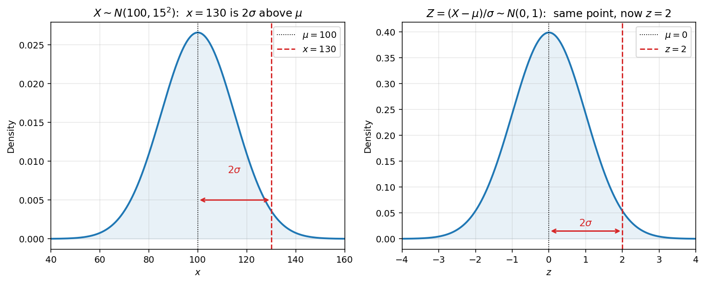
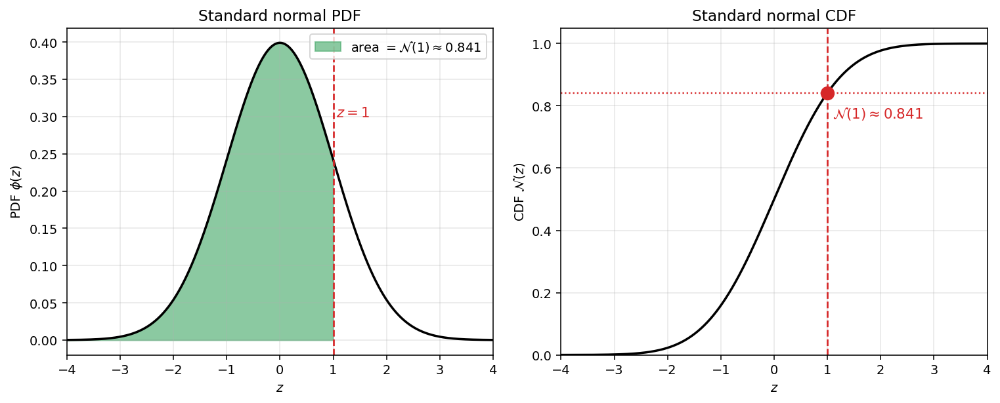

# 표준정규분포와 Z-점수

표준정규분포 $N(0,1)$ 은 다른 모든 정규분포를 견주어 보는 기준이 되는 분포이다. 임의의 $N(\mu, \sigma^2)$ 에 대한 확률과 분위수 문제는 이 절에서 다룰 **Z-점수 변환**을 거쳐 $N(0,1)$ 에 대한 문제로 바뀐다.

## Z-점수 변환

$X \sim N(\mu, \sigma^2)$ 이면 다음이 성립한다.

$$Z = \frac{X - \mu}{\sigma} \sim N(0, 1)$$

값 $z = (x - \mu)/\sigma$ 를 $x$ 의 **Z-점수**라 한다. 이것은 $x$ 가 평균보다 표준편차의 몇 배만큼 위(양수)에 있는지 아래(음수)에 있는지를 재는 값이다.

### Z-점수 읽기

- $z = 0$ — $x$ 가 평균과 같다.
- $|z| \leq 1$ — $x$ 가 평균에서 표준편차 하나 안에 있다("보통"의 범위).
- $|z| \geq 2$ — $x$ 가 평균에서 표준편차 두 개 이상 떨어져 있다(드문 일이다).
- $|z| \geq 3$ — $x$ 가 아주 드물다(정규분포에서 확률이 $0.3\%$ 미만이다).

Z-점수를 쓰면 서로 다른 정규분포에서 나온 값들을 같은 잣대 위에 놓고 견줄 수 있다.



*표준화의 실제 모습. 왼쪽: $X \sim N(100, 15^2)$ 에서 값 $x = 130$ 을 표시했다. 이 값은 $\mu = 100$ 에서 표준편차 두 개만큼 오른쪽에 있다. 오른쪽: $Z = (X - \mu)/\sigma$ 를 적용하면 같은 점이 표준정규분포에서 $z = 2$ 에 놓인다. 모양과 평균에 대한 상대적 위치는 그대로이고 잣대만 바뀐다. 모든 정규분포의 확률 문제는 표준화한 점에서 $\mathcal{N}(z)$ 를 찾아보는 일로 바뀐다.*



*적분 관계 $\mathcal{N}(z) = \int_{-\infty}^{z} \phi(s)\,ds$ 를 그림으로 본 것이다. 왼쪽: $z = 1$ 까지 확률밀도함수 아래의 색칠한 넓이가 $\approx 0.841$ 이다. 오른쪽: 누적분포함수가 $z = 1$ 에서 바로 그 높이를 지난다. 표나 소프트웨어에서 $\mathcal{N}(z)$ 를 읽는 일은 왼쪽 패널의 초록색 넓이를 재는 일과 같다.*

## 표준정규분포의 누적분포함수

다시 적으면 다음과 같다.

$$\mathcal{N}(x) = \int_{-\infty}^{x} \frac{1}{\sqrt{2\pi}} e^{-s^2/2}\,ds$$

이 적분은 닫힌 꼴이 없다. 값은 **표준정규분포표**나 수치 소프트웨어에서 얻는다.

### 표준정규분포표 읽는 법

표준정규분포표는 음이 아닌 $z$ 에 대하여 $\mathcal{N}(z)$ 를 보통 소수 둘째 자리까지 적어 놓았다. $\mathcal{N}(1.27)$ 을 찾으려면 다음과 같이 한다.

1. $1.2$ 라고 적힌 행을 찾는다.
2. $0.07$ 이라고 적힌 열을 찾는다.
3. 그 칸의 값 $\mathcal{N}(1.27) \approx 0.8980$ 이 표에서 읽은 값이다.

음수 $z$ 에 대해서는 아래의 대칭 규칙을 쓴다.

### 누적분포함수의 성질

| 성질 | 공식 |
|----------|---------|
| 구간 | $P(a \leq Z \leq b) = \mathcal{N}(b) - \mathcal{N}(a)$ |
| 대칭 | $\mathcal{N}(-x) = 1 - \mathcal{N}(x)$ |
| 여사건 | $P(Z \geq x) = 1 - \mathcal{N}(x)$ |
| 중앙값 | $\mathcal{N}(0) = \tfrac{1}{2}$ |

대칭 규칙은 $\phi(-x) = \phi(x)$ 에서 따라 나오며, 표에 $z \geq 0$ 만 실어도 되는 까닭이 바로 이것이다.

## 일반적인 정규분포의 누적분포함수

$X \sim N(\mu, \sigma^2)$ 에 대해서는 먼저 표준화한다.

$$P(X \leq x) = P\!\left(Z \leq \frac{x - \mu}{\sigma}\right) = \mathcal{N}\!\left(\frac{x - \mu}{\sigma}\right)$$

이것이 정규분포의 확률을 계산하는 으뜸 항등식이다. 어떤 정규분포의 누적분포함수를 묻든 $\mathcal{N}$ 을 한 번 찾아보는 일로 바뀐다.

## 분위수

$N(0,1)$ 의 $\alpha$-**분위수** $z_\alpha$ 는 다음을 만족하는 값이다.

$$\mathcal{N}(z_\alpha) = \alpha$$

$X \sim N(\mu, \sigma^2)$ 에 대해서는 표준화를 거꾸로 돌려 $\alpha$-분위수를 얻는다.

$$q_\alpha = \mu + \sigma \cdot z_\alpha$$

### 자주 쓰는 분위수

| $\alpha$ | $z_\alpha$ |
|----------|-----------|
| $0.025$ | $-1.960$ |
| $0.05$ | $-1.645$ |
| $0.10$ | $-1.282$ |
| $0.50$ | $0$ |
| $0.90$ | $1.282$ |
| $0.95$ | $1.645$ |
| $0.975$ | $1.960$ |

짝 $(z_{0.025}, z_{0.975})$, $(z_{0.05}, z_{0.95})$, $(z_{0.10}, z_{0.90})$ 은 대칭성에 따라 서로 거울상이다.

## 파이썬 구현

```python
"""표준화, 누적분포함수 찾기, 분위수 예제."""

from scipy import stats

# === 값 하나를 표준화한다 ===
mu, sigma = 100, 15
x = 130
z = (x - mu) / sigma
print(f"X ~ N({mu}, {sigma}^2): z-score of {x} is {z:.2f}")
print(f"P(X <= {x}) = N({z:.2f}) approx {stats.norm.cdf(z):.4f}")

# === N(0,1) 에서 자주 쓰는 분위수 ===
for alpha in [0.025, 0.05, 0.10, 0.90, 0.95, 0.975]:
    print(f"z_{alpha} approx {stats.norm.ppf(alpha):+.3f}")

# === 일반적인 정규분포의 분위수 ===
alpha = 0.975
q = mu + sigma * stats.norm.ppf(alpha)
print(f"{alpha} quantile of N({mu}, {sigma}^2) approx {q:.2f}")
```

**실행 결과:**

```
X ~ N(100, 15^2): z-score of 130 is 2.00
P(X <= 130) = N(2.00) approx 0.9772
z_0.025 approx -1.960
z_0.05  approx -1.645
z_0.1   approx -1.282
z_0.9   approx +1.282
z_0.95  approx +1.645
z_0.975 approx +1.960
0.975 quantile of N(100, 15^2) approx 129.40
```

## 연습문제

**연습문제 1.**
$X \sim N(50, 16)$ 일 때(따라서 $\sigma = 4$), $x = 58$ 의 Z-점수를 구하고 그 뜻을 풀이하여라.

??? success "연습문제 1 풀이"
    $z = (58 - 50)/4 = 2$ 이다. 값 $58$ 은 평균보다 표준편차 두 개만큼 위에 있고, 이는 위쪽 $2.3\%$ 꼬리에 들어간다. $\square$

---

**연습문제 2.**
대칭 규칙 $\mathcal{N}(-x) = 1 - \mathcal{N}(x)$ 과 표의 값 $\mathcal{N}(1.5) \approx 0.9332$ 만을 써서 $P(-1.5 \leq Z \leq 1.5)$ 를 구하여라.

??? success "연습문제 2 풀이"
    $$P(-1.5 \leq Z \leq 1.5) = \mathcal{N}(1.5) - \mathcal{N}(-1.5) = \mathcal{N}(1.5) - (1 - \mathcal{N}(1.5)) = 2\mathcal{N}(1.5) - 1$$

    값을 넣으면 $2(0.9332) - 1 = 0.8664$ 이다. $\square$

---

**연습문제 3.**
$\phi$ 가 우함수라는 사실에서 대칭 규칙 $\mathcal{N}(-x) = 1 - \mathcal{N}(x)$ 을 증명하여라.

??? success "연습문제 3 풀이"
    $\phi(-s) = \phi(s)$ 이므로 $u = -s$ 로 치환하면 다음을 얻는다.

    $$\mathcal{N}(-x) = \int_{-\infty}^{-x} \phi(s)\,ds = \int_{x}^{\infty} \phi(-u)\,du = \int_{x}^{\infty} \phi(u)\,du = 1 - \mathcal{N}(x)$$

    $\square$

---

**연습문제 4.**
$Z \sim N(0,1)$ 일 때 $P(|Z| \leq c) = 0.99$ 가 되는 값 $c$ 를 구하여라.

??? success "연습문제 4 풀이"
    $P(|Z| \leq c) = 2\mathcal{N}(c) - 1 = 0.99$ 이므로 $\mathcal{N}(c) = 0.995$ 이다. 표에서 $c = z_{0.995} \approx 2.576$ 이다. $\square$

---

**연습문제 5.**
$X_1, \ldots, X_{16}$ 이 i.i.d. $N(50, 64)$ 라 하자. $P(\bar{X} > 53)$ 을 구하여라.

??? success "연습문제 5 풀이"
    $\bar{X} \sim N(50, 64/16) = N(50, 4)$ 이므로 $\bar{X}$ 의 표준편차는 $2$ 이다.

    $$P(\bar{X} > 53) = 1 - \mathcal{N}\!\left(\frac{53 - 50}{2}\right) = 1 - \mathcal{N}(1.5) \approx 1 - 0.9332 = 0.0668$$

    $\square$

---

**연습문제 6. (도전 문제.)** *밀스 비의 점근.*
$Z \sim N(0, 1)$ 이고 $x > 0$ 일 때 다음 양쪽 경계를 증명하여라.

$$
\left(\frac{1}{x} - \frac{1}{x^3}\right)\phi(x) \;<\; 1 - \mathcal{N}(x) \;<\; \frac{\phi(x)}{x}
$$

그리고 이로부터 다음을 이끌어 내어라.

$$
1 - \mathcal{N}(x) \;\sim\; \frac{\phi(x)}{x} \quad \text{as } x \to \infty
$$

또는

$$
\int_x^\infty \frac{1}{\sqrt{2\pi}}e^{-t^2/2}dt \;\sim\; \frac{1}{x\sqrt{2\pi}}e^{-x^2/2} \quad \text{as } x \to \infty
$$

이 어림은 꽤 날카로워서 $x$ 가 어느 정도 크기만 하면 가우스 꼬리확률을 확률밀도함수에서 바로 읽어 낼 수 있다. 예를 들어 $1 - \mathcal{N}(3) \approx \phi(3)/3 \approx 0.00148$ 인데 참값은 $\approx 0.00135$ 이므로 오차가 $10\%$ 미만이다.

*힌트.* 항등식 $\phi'(t) = -t \phi(t)$ 를 쓰고 $\int_x^\infty \phi(t)\,dt$ 에 부분적분을 적용하여라.

??? success "연습문제 6 풀이"
    **위쪽 경계.** 꼬리 적분을 적고 $t/t$ 를 끼워 넣는다.

    $$
    1 - \mathcal{N}(x) = \int_x^\infty \phi(t)\,dt = \int_x^\infty \frac{1}{t}\,\bigl(t\,\phi(t)\bigr)\,dt
    $$

    $u = 1/t$, $dv = t\,\phi(t)\,dt$ 로 놓고 부분적분을 한다. $\phi'(t) = -t\,\phi(t)$ 에서 $v = -\phi(t)$ 를 얻고 $du = -1/t^2\,dt$ 이다. 따라서 다음이 성립한다.

    $$
    \int_x^\infty \frac{1}{t}\,(t\phi(t))\,dt = \left[-\frac{\phi(t)}{t}\right]_x^\infty - \int_x^\infty \frac{\phi(t)}{t^2}\,dt = \frac{\phi(x)}{x} - \int_x^\infty \frac{\phi(t)}{t^2}\,dt
    $$

    남은 적분은 엄격히 양수이므로 다음을 얻는다.

    $$
    1 - \mathcal{N}(x) < \frac{\phi(x)}{x}
    $$

    **아래쪽 경계.** 남은 항 $\int_x^\infty \phi(t)/t^2\,dt$ 에 같은 부분적분 요령을 쓰되, 이번에는 $u = 1/t^3$, $dv = t\,\phi(t)\,dt$ 로 놓는다.

    $$
    \int_x^\infty \frac{\phi(t)}{t^2}\,dt = \int_x^\infty \frac{1}{t^3}\,(t\phi(t))\,dt = \frac{\phi(x)}{x^3} - 3\int_x^\infty \frac{\phi(t)}{t^4}\,dt < \frac{\phi(x)}{x^3}
    $$

    남은 항에 대한 이 위쪽 경계를 $\phi(x)/x$ 에서 빼면 다음을 얻는다.

    $$
    1 - \mathcal{N}(x) = \frac{\phi(x)}{x} - \int_x^\infty \frac{\phi(t)}{t^2}\,dt > \frac{\phi(x)}{x} - \frac{\phi(x)}{x^3} = \left(\frac{1}{x} - \frac{1}{x^3}\right)\phi(x)
    $$

    **점근.** 양쪽 경계를 $\phi(x)/x > 0$ 으로 나누면 다음을 얻는다.

    $$
    1 - \frac{1}{x^2} < \frac{1 - \mathcal{N}(x)}{\phi(x)/x} < 1
    $$

    $x \to \infty$ 로 보내면 아래쪽 경계가 $1$ 로 가므로 조임정리에 따라 다음이 성립한다.

    $$
    \lim_{x \to \infty} \frac{1 - \mathcal{N}(x)}{\phi(x)/x} = 1
    $$

    이것이 밀스 비의 점근이다. $\square$
