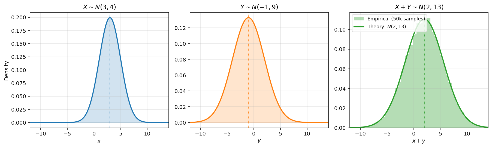

# 독립인 정규확률변수의 합

정규분포 집안의 두드러진 특징은 합에 대해 닫혀 있다는 것이다. 독립인 정규확률변수를 더하면 또 정규확률변수가 되고, 평균과 분산은 그저 더해진다. 그래서 정규분포는 합이나 표본평균을 다룰 때 유난히 다루기 쉽다.

## 주요 결과

$X \sim N(\mu_1, \sigma_1^2)$ 와 $Y \sim N(\mu_2, \sigma_2^2)$ 가 **독립**이면 다음이 성립한다.

$$X + Y \sim N(\mu_1 + \mu_2, \, \sigma_1^2 + \sigma_2^2)$$

더 일반적으로 $X_i \sim N(\mu_i, \sigma_i^2)$ 인 독립인 $X_1, \ldots, X_n$ 에 대하여 다음이 성립한다.

$$\sum_{i=1}^n X_i \sim N\!\left(\sum_{i=1}^n \mu_i, \, \sum_{i=1}^n \sigma_i^2\right)$$

## 적률생성함수를 이용한 증명

적률생성함수 $M_{X_i}(t) = e^{\mu_i t + \frac{1}{2}\sigma_i^2 t^2}$ 와 독립성을 쓰면 다음을 얻는다.

$$M_{X + Y}(t) = M_X(t) \cdot M_Y(t) = \exp\!\left((\mu_1 + \mu_2)t + \tfrac{1}{2}(\sigma_1^2 + \sigma_2^2)t^2\right)$$

이것은 $N(\mu_1 + \mu_2, \sigma_1^2 + \sigma_2^2)$ 의 적률생성함수이다. 적률생성함수의 유일성에 따라 결과가 따라 나온다. $\square$



*독립인 정규확률변수의 합은 여전히 정규분포를 따른다. 왼쪽과 가운데: $X \sim N(3, 4)$ 와 $Y \sim N(-1, 9)$ 의 확률밀도함수. 오른쪽: $X + Y$ 의 몬테카를로 표본 50,000개(히스토그램)가 이론적인 $N(2, 13)$ 밀도함수(실선)와 맞아떨어진다. 평균은 평균의 합이고 분산은 분산의 합이며, 모양은 여전히 완벽한 종 모양이다.*

!!! warning "주변분포가 정규분포인 것만으로는 모자라다"
    각각의 주변분포가 정규분포인 두 확률변수의 합이 반드시 정규분포를 따르는 것은 **아니다**. 두 확률변수가 독립이거나, 더 일반적으로 *결합*정규분포를 따라야 한다. 다음 소절에서 구체적인 반례를 든다. 결합정규성 조건의 일반적인 꼴은 뒤의 장에서 다룬다.

## 주변정규성에 대한 반례

$X \sim N(0, 1)$ 이라 하고, 이와 독립인 무작위 부호 $S$ 를 다음과 같이 두자.

$$S = \begin{cases} +1 & \text{확률 } 1/2 \text{ 로} \\ -1 & \text{확률 } 1/2 \text{ 로} \end{cases}$$

그리고 $Y = SX$ 로 정의하자.

**$Y$ 의 주변분포는 $N(0, 1)$ 이다.** $S = +1$ 이라는 조건 아래에서 $Y = X \sim N(0,1)$ 이고, $S = -1$ 이라는 조건 아래에서는 대칭성에 따라 $Y = -X \sim N(0,1)$ 이다. 따라서 조건 없이도 $Y \sim N(0,1)$ 이다.

**그러나 $X + Y$ 는 정규분포를 따르지 않는다.** 다음이 성립하기 때문이다.

$$X + Y = X + SX = (1 + S)X = \begin{cases} 2X & S = +1 \text{ 이면} \\ 0 & S = -1 \text{ 이면} \end{cases}$$

곧 $X + Y$ 는 확률 $1/2$ 로 $2X \sim N(0, 4)$ 이고 확률 $1/2$ 로 정확히 $0$ 이다. 이 혼합분포는 $0$ 에 원자를 갖고 있으므로 정규분포가 아니다.

짝 $(X, Y)$ 는 주변분포는 정규분포이지만 결합정규분포를 따르지는 않으며, 그 합도 정규분포가 되지 못한다.

## i.i.d. 표본의 특별한 경우

i.i.d. $X_1, \ldots, X_n \sim N(\mu, \sigma^2)$ 에 대하여 다음이 성립한다.

| 양 | 분포 |
|----------|-------------|
| $S_n = \sum X_i$ | $N(n\mu, n\sigma^2)$ |
| $\bar{X}_n = S_n / n$ | $N(\mu, \sigma^2/n)$ |
| $(S_n - n\mu)/(\sigma\sqrt{n})$ | 정확히 $N(0, 1)$ |

가운데 줄은 정규분포에 바탕을 둔 추론의 뼈대이다. i.i.d. 정규확률변수 $n$ 개의 표본평균은 다시 정규분포를 따르며, 중심은 $\mu$ 이고 분산은 $1/n$ 처럼 줄어든다. 이것이 $\bar{X}_n$ 을 $\mu$ 의 좋은 추정량으로 만들어 주며, 정규분포가 아닌 표본에 대해 중심극한정리가 점근적으로 주는 결과를 정규분포에서는 정확한 분포로 얻은 것이기도 하다.

## 파이썬으로 확인하기

```python
"""정규확률변수의 합에 대한 결과를 경험적으로 확인한다."""

import numpy as np
from scipy import stats

rng = np.random.default_rng(42)
n = 100_000

# === 독립인 정규확률변수의 X + Y ===
X = rng.normal(3, 2, n)   # N(3, 4)
Y = rng.normal(-1, 3, n)  # N(-1, 9)
S = X + Y                 # N(2, 13) 이 되어야 한다

print("X + Y ~ N(2, 13)")
print(f"  Sample mean: {S.mean():.4f}  (expected 2)")
print(f"  Sample var:  {S.var():.4f}  (expected 13)")

# === 정규성 검정 ===
_, p_value = stats.shapiro(S[:5000])
print(f"  Shapiro-Wilk p-value: {p_value:.4f}")
```

## 연습문제

**연습문제 1.**
$X \sim N(3, 4)$ 와 $Y \sim N(-1, 9)$ 가 독립이라 하자. $X + Y$ 의 분포와 $P(X + Y > 5)$ 를 구하여라.

??? success "연습문제 1 풀이"
    $X + Y \sim N(3 + (-1), 4 + 9) = N(2, 13)$ 이다.

    $$P(X + Y > 5) = P\!\left(Z > \frac{5 - 2}{\sqrt{13}}\right) = P(Z > 0.832) \approx 1 - 0.7973 = 0.2027$$

    $\square$

---

**연습문제 2.**
$X_1, \ldots, X_{25}$ 가 i.i.d. $N(10, 4)$ 라 하자. $\bar{X} = \frac{1}{25}\sum X_i$ 의 분포를 구하여라.

??? success "연습문제 2 풀이"
    $\sum X_i \sim N(250, 100)$ 이므로 다음이 성립한다.

    $$\bar{X} = \frac{1}{25}\sum X_i \sim N\!\left(10, \frac{4}{25}\right) = N(10, 0.16)$$

    $\bar{X}$ 의 표준편차는 $0.4$ 이다. $\square$

---

**연습문제 3.**
독립인 두 측정 장비가 참값이 $\theta$ 인 양을 잰다. 장비 1은 $X_1 \sim N(\theta, 4)$ 를, 장비 2는 $X_2 \sim N(\theta, 9)$ 를 내놓는다. $\hat{\theta} = wX_1 + (1-w)X_2$ 를 생각하자.

(a) 어떤 $w$ 에 대해서도 $\hat{\theta}$ 이 불편추정량임을 보여라.

(b) $\operatorname{Var}(\hat{\theta})$ 을 가장 작게 하는 $w$ 와 그때의 분산을 구하여라.

??? success "연습문제 3 풀이"
    (a) $E[\hat{\theta}] = w\theta + (1-w)\theta = \theta$ 이므로 어떤 $w$ 에 대해서도 불편추정량이다.

    (b) $\operatorname{Var}(\hat{\theta}) = 4 w^2 + 9 (1 - w)^2$ 이다. 미분하여 $0$ 으로 놓으면 $8w - 18(1 - w) = 0$ 이므로 $w = 9/13$ 이다.

    $$\operatorname{Var}(\hat{\theta}) = 4 \cdot \frac{81}{169} + 9 \cdot \frac{16}{169} = \frac{468}{169} = \frac{36}{13} \approx 2.769$$

    가장 좋은 가중치는 각 장비의 분산에 반비례한다. 이것은 역분산 가중의 한 특별한 경우이다. $\square$

---

**연습문제 4.**
본문의 반례 $X \sim N(0,1)$, $Y = SX$ 를 이어서 생각하자. 여기서 $S \in \{-1, +1\}$ 은 독립인 무작위 부호이다.

(a) $E[XY]$ 를 계산하고 $X$ 와 $Y$ 가 무상관임을 보여라.

(b) $X$ 와 $Y$ 는 독립인가? 간단히 까닭을 밝혀라.

??? success "연습문제 4 풀이"
    (a) $S$ 와 $X$ 가 독립이므로 다음이 성립한다.

    $$E[XY] = E[X \cdot SX] = E[S] \cdot E[X^2] = 0 \cdot 1 = 0$$

    $E[X] = E[Y] = 0$ 이므로 공분산은 $\operatorname{Cov}(X, Y) = E[XY] = 0$ 이고, 따라서 $X$ 와 $Y$ 는 무상관이다.

    (b) 두 확률변수는 독립이 **아니다**. 만약 독립이라면 이 절의 주요 정리에 따라 $X + Y$ 가 정규분포를 따라야 하지만, 앞에서 $X + Y$ 가 $0$ 에 원자를 갖는다는 것을 보았다. 그러므로 독립이 아니다.

    이 짝은 두 주변분포가 모두 정규분포일 때조차 **무상관**이 **독립**을 뜻하지 않음을 보여 준다. 빠진 조건은 결합정규성이다. $\square$

---

**연습문제 5.**
하루 수익률이 $R_t \sim N(0.001, 0.02^2)$ 이라 하자(날마다 i.i.d.). $20$ 일 누적수익률 $\sum_{t=1}^{20} R_t$ 의 분포를 구하고, 그 값이 $5\%$ 를 넘을 확률을 구하여라.

??? success "연습문제 5 풀이"
    $\sum_{t=1}^{20} R_t \sim N(20 \cdot 0.001, \, 20 \cdot 0.0004) = N(0.02, 0.008)$ 이므로 표준편차는 $\sqrt{0.008} \approx 0.0894$ 이다.

    $$P\!\left(\sum R_t > 0.05\right) = 1 - \mathcal{N}\!\left(\frac{0.05 - 0.02}{0.0894}\right) = 1 - \mathcal{N}(0.336) \approx 1 - 0.6315 = 0.3685$$

    $\square$
